# PDS Diary


PDS 다이어리는 하루 24시간을 10분 단위로 일정을 관리 할 수 있는 다이어리 웹 앱입니다.

<hr>

#### 🔗 Depoly : https://www.pdsdiary.com | [📝 Notion](https://sand-tapir-46f.notion.site/Solo-Project-PDS-Diary-0967a6d7b7344b0bbfc47ac22b39bfb5?pvs=4)

<br />

## 💼 목차
- ### [🚀 기술 스택](#기술-스택)
- ### [💡 기획 단계](#기획-단계)
  - [1. PDS 다이어리란?](#1-pds-다이어리란)
  - [2. PDS 다이어리의 장점](#2-pds-다이어리의-장점)
  - [3. 프로젝트의 목표](#3-프로젝트의-목표)
    - [3.1 웹으로 다이어리를 개발할 때 편리한 UI/UX 구현을 위한 고민](#31-웹으로-다이어리를-개발할-때-편리한-uiux-구현을-위한-고민)
    - [3.2 텍스트 편집기 & 드래그 기능을 직접 구현을 통한 원리 이해](#32-텍스트-편집기--드래그-기능을-직접-구현을-통한-원리-이해)
  - [4 기술 검증 POC](#4-기술-검증-poc)
- ### [⚒️ 기능 소개](#기능-소개)
- ### [👆🏻 UI / UX 개선](#ui-ux-개선)
- ### [🔥 기술 챌린지](#기술-챌린지)
  - [1. ⏱️ 10분 단위의 시간 셀을 어떻게 렌더링 할 수 있을까?](#1-10분-단위의-시간-셀을-어떻게-렌더링-할-수-있을까?)
    - [1.1 초기 접근 방식 : 렌더링 구조를 고려해서 1시간을 24번 반복 렌더링 하기](#11-초기-접근-방식--렌더링-구조를-고려해서-1시간을-24번-렌더링-하기)
    - [1.2 문제 인식 : 다음 행으로 넘어가는 시간셀에 연속적인 드래그 기능 구현의 어려움](#12-문제-인식--다음-행으로-넘어가는-시간셀에-연속적인-드래그-기능-구현의-어려움)
    - [1.3 해결 방안 모색 : 144개의 시간정보를 가진 데이터 반복 렌더링](#13-해결-방안-모색--144개의-시간정보를-가진-map-데이터-반복-렌더링)
    - [1.4 추가 문제 해결 : 합성 컴포넌트 방식을 사용한 시간 표시 셀 렌더링](#14-추가-문제-해결--합성-컴포넌트-방식을-사용한-시간-표시-셀-렌더링)
    - [1.5 구현 결과 : Map을 활용한 빠른 데이터 조회와 시간의 순서 보장](#15-구현-결과--map을-활용한-빠른-데이터-조회와-시간의-순서-보장)
  - [2. ⇱ 셀의 드래그 기능은 어떻게 구현할수 있을까?](#2-셀의-드래그-기능은-어떻게-구현할-수-있을까?)
    - [2.1 아이디어 : 여러가지 마우스 이벤트를 조합한 드래그 핸들러 작성](#21-아이디어--여러가지-마우스-이벤트를-조합한-드래그-핸들러-작성)
    - [2.2 구현 과정 : 드래그 동작 과정에서 적절하게 UI 변경해주기](#22-구현-과정--드래그-동작-과정에서-적절한-ui-변경해주기)
    - [2.3 문제 인식: 드래그의 방향을 어떻게 판별 할 수 있을까?](#23-문제-인식-드래그의-방향을-어떻게-판별-할-수-있을까)
    - [2.4 문제 해결 : `useRef`를 활용해서 인덱스를 저장해서 계산하자](#24-문제-해결--useref를-활용해서-인덱스를-저장해서-계산하자)
  - [3. 시간 셀의 일정 관리는 어떻게 해야할까?](#3-시간-셀의-일정-관리는-어떻게-해야할까?)
    - [3.1 이벤트 관리 : 전역상태로 관리하고 변경사항 발생시 전역상태와 DB에 업데이트](#31-이벤트-관리--전역상태로-관리하고-변경사항-발생시-전역상태와-db에-업데이트)
    - [3.2 UI/UX : Google Sheet에 착안한 이벤트 유무에 따른 작업 선택 토글창 렌더링](#32-uiux--google-sheet에-착안한-이벤트-유무에-따른-작업-선택-토글창-렌더링)
    - [3.3 예외 케이스 처리 : 중복된 이벤트 추가 방지를 위한 드래그 기능 제한](#33-예외-케이스-처리--중복된-이벤트-추가-방지를-위한-드래그-기능-제한)
  - [4. 📝 textEditor 어떻게 구현 할 수 있을까?](#4-textEditor-어떻게-구현-할-수-있을까?)
    - [4.1 구현 방법 찾기 :`execCommand()`를 사용해서 스크롤 된 텍스트에 스타일 적용](#41-구현-방법-찾기--execcommand를-사용해서-스크롤-된-텍스트에-스타일-적용하기)
    - [4.2 문제 인식 : 직접적인 DOM조작은 리액트에서 권장하는 방식이 아니다?!](#42-문제-인식--상태-변화를-통하지-않고-직접적인-dom조작은-리액트에서-권장하는-방식이-아니다)
    - [4.3 문제 해결 : `window.getSelection()`을 사용해서 스타일 적용 후 DOM String 을 상태로 관리하기](#43-문제-해결--windowgetselection을-사용해서-스타일-적용-후-dom-string-을-상태로-관리하기)
    - [4.4 구현 결과 : 부분적인 텍스트 편집 기능 구현 및 엣지케이스에 따른 추가 로직 필요](#44-구현-결과--부분적인-텍스트-편집-기능-구현-및-엣지케이스에-따른-추가-로직-필요)
- ### [🗓️ 개발 일정](#개발-일정)
  - [개발 기간: 2024.03.04 ~ 2024.03.27 (3주)](#개발-기간-20240304월--20240327수-3주)
  - [개발 내용](#1주차)
- ### [✍️ 프로젝트 회고](#프로젝트-회고)

<br />

<h2 id="기술-스택">🚀 기술 스택</h2>

### FrontEnd
<div style="display:flex;">
  &nbsp;
  &nbsp;
  &nbsp;
  &nbsp;
</div>

### BackEnd

<div style="display:flex;">
  &nbsp;
  &nbsp;
  &nbsp;
  
</div>

<br />

<h2 id="기획-단계">💡 기획 단계</h2>

### 시간 관리에 어려움을 겪는 현대인들
나는 하루 24시간을 어떻게 보내고 있을까? 돌이켜 보면 생각보다 몰입도 있게 업무에 집중했던 시간은 짧고 계획 없이 낭비하는 시간이 길다는 사실에 놀랐던 경험이 있을것이라고 생각합니다.

### 다이어리를 활용한 시간관리
저 또한 이런 경험이 많았고 시간을 좀 더 의미있게 사용하고자 시간 관리 방법으로 다이어리를 활용하였고 저에게 큰 도움이 되던 이 다이어리를 더 많은 사용자가 사용할 수 있도록 웹으로 만들면 좋겠다는 생각으로 다이어리를 주제로 선정하게 되었습니다.

### 1. PDS 다이어리란?


프로젝트의 레퍼런스로 삼고자 했던 `PDS 다이어리`의 PDS란 Plan, Do, See 의 약어로 하룻동안 시간을 어떻게 사용하는지 매일 회고하면서 점차 개선된 시간 계획을 수립해서 목표를 달성할 수 있도록 기획된 다이어리 입니다.

### 2. PDS 다이어리의 장점

여러가지 다이어리 레이아웃 중에서 PDS 다이어리를 차용하고자 했던 이유로는 다음과 같습니다.

<table>
  <tr>
    <th>PDS 다이어리 레이아웃</th>
    <th>PDS 웹 클라이언트 레이아웃</th>
  </tr>
  <tr>
    <td>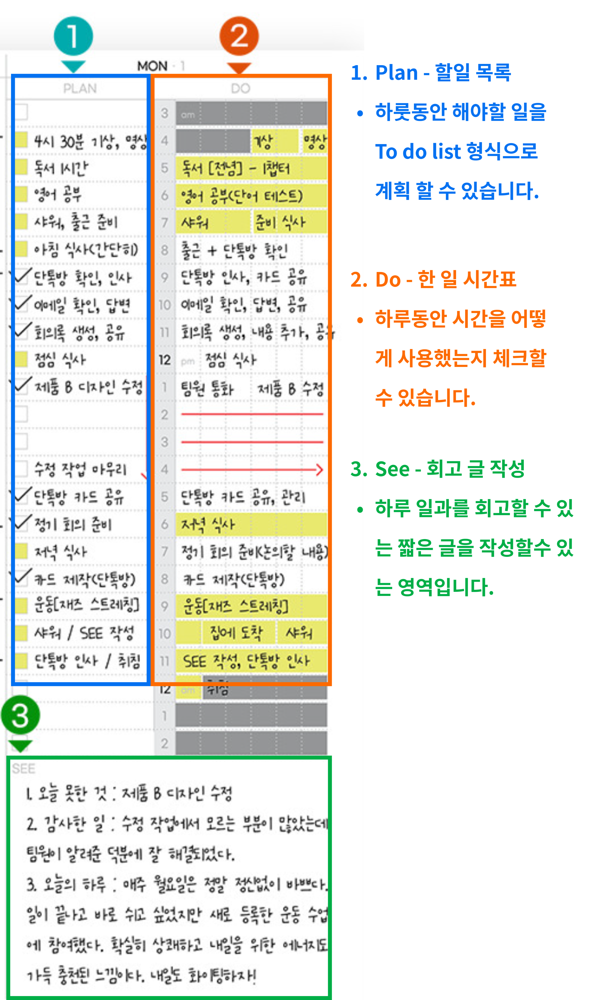</td>
    <td>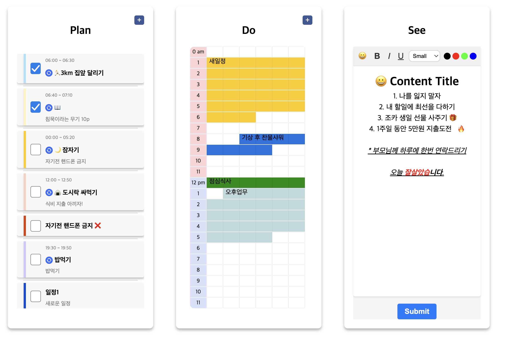</td>
  </tr>
</table>

1. **10분 단위의 시간 관리**

    30분이나 1시간 단위로 일정을 관리하는 서비스는 많았으나, 10분 단위로 일정을 계획할 수 있는 서비스는 별로 없어서 시간을 집약적으로 계획할 수 있다는 장점이 있습니다.

2. **회고 작성을 통한 빠른 피드백 반영**

    매일 하룻동안의 일정을 회고하며 글을 작성할수 있는 영역이 있어서 내일 일정을 계획할 때 피드백을 통해 개선된 일정을 계획할 수 있다는 장점이 있었습니다.

3. **직관적인 레이아웃 디자인**

    다이어리에 핵심이 되는 3가지 영역만으로 하룻 동안 어떻게 시간을 사용했는지 직관적으로 파악 할 수 있다는 장점이 있었습니다.

### 3. 프로젝트의 목표

이번 프로젝트를 통해서 달성하고자 했던 목표로는 아래와 같습니다.

  #### 3.1 웹으로 다이어리를 개발할 때 편리한 UI/UX 구현을 위한 고민

- 다이어리를 수기로 작성하지 않고 웹에서 작성하고자 할 때 사용자가 기대하는 UI/UX를 충족하기 위해서 어떤 점을 고려해야 할지 고민하면서 앞으로 사용자 경험 주도 개발을 하기 위해서 좋은 경험이 죌것이라고 생각했습니다.<br />

- 웹에서 편리한 UI/UX을 제공하고자 고민했던 부분은 다음과 같습니다.<br />

  **편리한 시간 선택과 일정 추가 시 스타일 적용** 
  

  |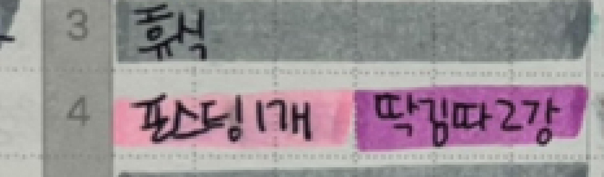|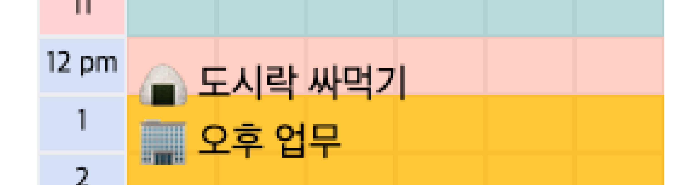|
  |----|----|
  |다이어리에서 일정 추가 시|웹에서 일정 추가 시|
  
  - 수기로 작성하는 다이어리에서 일정을 구분할때는 배경색으로 구분짓는 경우가 많기에  웹에서도 일정을 추가할 때 배경색을 지정해서 일정을 구분지을 수 있게 하고자 했습니다.
  
  - 사용자가 드래그 한 셀의 영역 만큼 시간을 특정지어 일정을 추가할 수 있도록 했습니다. <br />

  **반복된 일정의 복사 기능** 
  
  - 사용자가 같은 일정을 반복해서 추가 하고자 할 때 내용을 반복해서 입력하지 않아도 이미 추가된 일정을 복사해서 원하는 구간에 붙여넣기할 수 있도록 하고자 했습니다.

  **텍스트 편집 기능 제공** 
  
  - 사용자가 하루의 일정을 회고할 수 있는 텍스트 영역에서 간단한 스타일도 함께 적용 할 수 있는 텍스트 편집기 기능을 구현하고자 했습니다. <br />

  #### 3.2 텍스트 편집기 & 드래그 기능을 직접 구현을 통한 원리 이해

  일상속에서 자주 접하는 드래그 기능이나 텍스트 편집기능이 어떻게 동작하는지 라이브러리를 사용하지 않고 직접 구현하면서 이해하고자 했습니다.<br />

### [4. 기술 검증 (POC)](https://sand-tapir-46f.notion.site/POC-7abb3e99592e4a1a82aae5a94edc6a47?pvs=4)

<h2 id="기능-소개">⚒️ 기능 소개</h2>

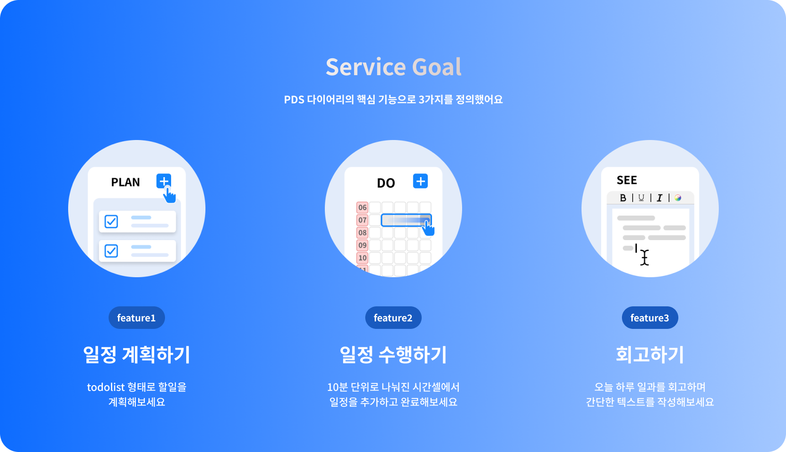

### 1) 일정 복사 기능
<details>
  <summary>🎥 미리 보기</summary>
  <p>
    
  </p>
</details>

→ 이미 추가된 일정을 복사하여서 원하는 시간에 동일한 일정을 붙여넣기 할 수 있습니다.<br />
> 클립보드에 복사된 이벤트가 있으면 붙여넣기 할수있는 버튼이 렌더됩니다.<br />
> 추가하려는 시간에 기존 이벤트가 존재하면 에러 토스트가 렌더링됩니다.
<br />

**개선할 점**
- 현재는 복사된 이벤트를 한번만 붙여넣기 해도 전역상태로 저장된 클립보드 데이터가 사라지는데, 한번 복사된 이벤트를 여러번 붙여넣을 수 있도록 로직을 개선하는것을 고려중입니다.

### 2) 일정 드래그 기능
<details>
  <summary>🎥 미리 보기</summary>
  <p>
    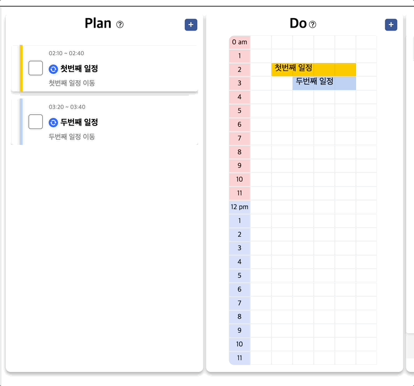
  </p>
</details>

→ 사용자가 이미 추가한 일정을 드래그 하여서 시간을 변경 할 수 있습니다. <br />
> 일정이 존재하는 셀로 드래그 하는 경우 에러 토스트가 렌더링 됩니다.<br />
> 연동된 일정의 경우 대응 하는 일정의 시간도 함께 변경됩니다.
<br />

### 3) 일정 연동 기능

<details>
  <summary>🎥 시연 영상</summary>
  <p>
    
  </p>
</details>

→ 사용자가 Plan 섹션에서 일정 추가시 연동 버튼을 누르면 Do 섹션에도 동일한 이벤트가 추가되고 해당 일정을 수정하는 경우 대응하는 일정에 변경사항이 동기화되어서 적용됩니다.<br />


**개선할 점**

- 현재는 연동된 일정의 경우 Plan 섹션에서 이벤트를 수정하면 Do 섹션에도 바로 반영이 되는 반면에 Do 섹션에서는 이벤트를 수정 하는 경우 바로 연동이 되지 않는다. 

<br />

### 4) 일정 삭제 기능

<details>
  <summary>🎥 시연 영상</summary>
  <p>
    
  </p>
</details>

→ 연동된 일정을 삭제하거나 수정하는 경우 대응하는 일정에도 변경사항이 함께 적용됩니다. <br />
> 일정 선택시 작업을 선택할수 있는 모달창이 렌더링 됩니다. <br />

### 5) 텍스트 편집 기능

<details>
  <summary>🎥 시연 영상</summary>
  <p>
    
  </p>
</details>

→ See 섹션에서 사용자가 하루 일정에 대한 리뷰를 작성 할 수 있습니다.<br />
> 사용자가 선택한 글자의 영역에 스타일이 적용됩니다.<br />

<br />
<h2 id="ui-ux개선"> 👆🏻 UI / UX 개선</h2>
<h3>유저 테스트 기반 사용자 경험 개선</h3>

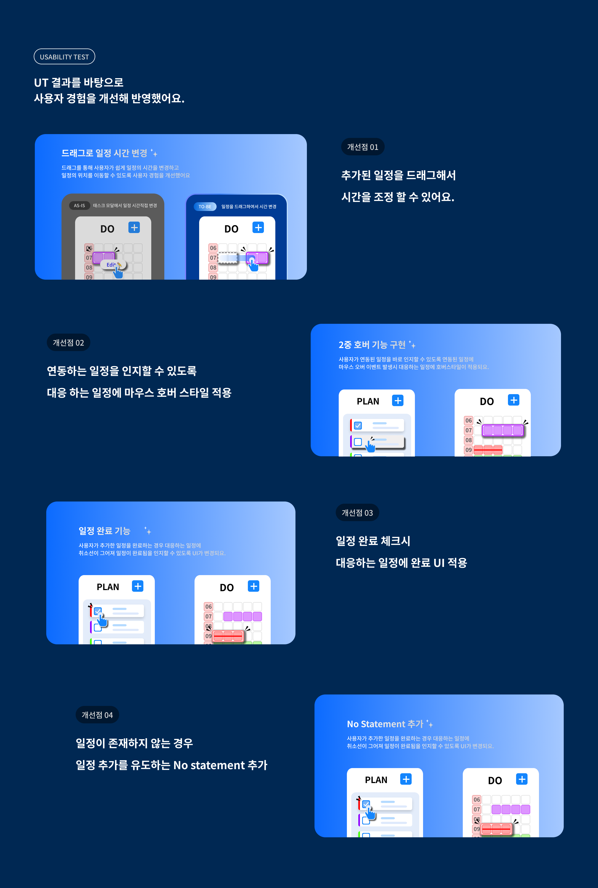

<h2 id="기술-챌린지">🔥 기술 챌린지</h2>

<h3 id="1-10분-단위의-시간-셀을-어떻게-렌더링-할-수-있을까?">1. ⏱️ 10분 단위의 시간 셀을 어떻게 렌더링 할 수 있을까?</h3>

#### 1.1 초기 접근 방식 : 렌더링 구조를 고려해서 1시간을 24번 렌더링 하기

> 1시간을 10분 간격으로 6칸으로 나눈 `Array` 를 24번 반복 렌더링 하기

처음에는 24시간을 6 * 24 의 표 형태로 렌더링 하기 위해서 10분단위로 6칸으로 나누어진 1시간 셀을 세로로 24번 반복 렌더링 하고자 했습니다.

그래서 저는 24개의 요소를 가진 배열형태를 고려했었고 각 요소를 Object 형태로 key값으로는 시간 문자열을 가지고 value값으로는 10분 간격의 시간데이터를 배열로 가지게 데이터를 구상했었습니다.


```js
const time = [
  { "01:00": [0, 10, 20, 30, 40, 50] },
  { "02:00": [0, 10, 20, 30, 40, 50] },
  // ... 22개의 나머지 시간들
];
```

<br />

#### 1.2 문제 인식 : 다음 행으로 넘어가는 시간셀에 연속적인 드래그 기능 구현의 어려움

  - 시간마다 데이터를 반복 렌더링 할때마다 공통으로 사용되는 이벤트 핸들러를 Prop으로 추가 해주어야 하기 때문에 코드의 가독성이 낮아진다고 판단했습니다.
  - 시간 셀을 드래그 하여서 시간을 연속적으로 선택 할 수 있어야했는데 다음 행으로 넘어가는 시간의 시간을 특정 짓기 위해서 time 배열 데이터를 다시 순회해서 시간의 연속성을 추가 로직이 필요했습니다.

<br />

#### 1.3 해결 방안 모색 : 144개의 시간정보를 가진 Map 데이터 반복 렌더링

> 24시간을 10분으로 나눈 144개의 요소를 가진 `Object` 를 반복 렌더링 하기

기존의 24개의 요소를 가진 Array를 순회하며 반복 렌더링 하는 방법에서 144개의 요소를 가진 Object를 반복 렌더링 하는 방법으로 변경하였습니다.

각 요소의 key 값으로는 시간 셀이 있고 value 값으로는 시간정보와, 이벤트 정보를 가지고 있는 object 를 넣어줌으로서 연속적인 시간을 렌더링 하므로 드래그 기능을 구현하기 편리할것이라고 생각했습니다.


```js
const time = {
  "00:00" : { time: "00:00", event: null },
  "00:10" : { time: "00:10", event: null },
  // ... 142개의 나머지 시간들
}
```

|CSS flex-wrap 속성 값에 따른 레이아웃 구조 차이점|
|----|
||

- 하나의 행에서 시간 셀이 6칸이 넘어가는 경우 다음 행으로 줄바꿈 되어서 렌더링 되도록 하나의 행에 width 값을 지정한 뒤 `flex-wrap: wrap` CSS 속성을 추가해서 한 행의 가로 길이를 넘어가는 경우 다음줄로 줄바꿈 되서 렌더링 되도록 했습니다.


🚫 문제 발생

```js
const time = {
  "00:00" : { time: "00:00", event: null },
  "00:10" : { time: "00:10", event: "3km 달리기" },
  // ... 142개의 나머지 시간들
}

function getEventByTime(targetTime) {
  const entries = Object.entries(time);

  // Objcet 객체를 한번더 순회하며 O(1)의 시간복잡도를 가짐.
  const [time, event] = entries.find([key, value] => key === targetTime);
  
  return event;
}

console.log(getEventByTime("00:00")); // null
console.log(getEventByTime("00:10")); // "3km 달리기"

```

  - Object는 인덱스가 없으므로 특정 시간을 가진 키값의 데이터에 접근하기 위해서 한번 더 객체를 순회하기 때문에 빠르게 데이터를 조회할 수 있는 Object의 특징을 활용할 수 없었습니다.
  
  - 특정 시간의 이벤트에 변동사항이 생기는 경우 해당 객체의 키값을 재할당 후 렌더링 할때 Object는 시간의 연속성을 보장할수 없는 문제가 발생했습니다.


✅ 문제 해결
  - Object의 장점을 활용하면서도 객체의 생성순서를 보장하는 Map 자료구조를 활용했습니다.

<br />

#### 1.4 추가 문제 해결 : 합성 컴포넌트 방식을 사용한 시간 표시 셀 렌더링

시간 셀을 렌더링 할 때 각 행이 몇시를 가르키는지 왼쪽에 시간을 표시해주어야 했습니다.


**💡 초기 아이디어 : 시간을 표시하는 셀을 분리해서 컴포넌트로 렌더링하자**

24개의 시간을 표시해주어야 했기 때문에 반복 렌더링을 해야함을 의미했고, 일정을 추가하기 위한 시간 셀의 영역과 같은 높이로 렌더링을 해야 했기 때문에 `TimeCells`와 마찬가지로 `TimeCell`을 재사용해서 반복 렌더링 해서 시간 표시를 위한 셀을 렌더링 하고자 했습니다.

그리고 시간 셀의 영역의 드래그 로직에 영향을 주면 안됬기 때문에 시간 셀의 영역과 분리해서 시간을 표시해주는 셀의 영역을 컴포넌트로 만들어서 왼쪽에 따로 렌더링 하는 방법을 생각했었습니다.

하지만 그럴경우 추가적으로 컴포넌트를 작성해야할 뿐만 아니라 `TimeCell`을 반복 렌더링 하기 위한 로직을 반복적으로 작성하게 되므로 코드의 간결성을 저해하게 되었습니다.

<br />

**💡 개선된 아이디어 : `TimeCell`을 재사용해서 합성 컴포넌트 방식을 사용하자**

`TimeCells` 컴포넌트를 렌더링할 때 먼저 시간을 표시해주는 셀을 먼저 렌더링하고 일정을 추가를 위한 시간 셀의 영역을 렌더링하는 합성 컴포넌트 방식을 사용해서 시간 셀표시를 위한 컴포넌트를 따로 작성하지 않고 `TimeCell`을 반복 렌더링을 위한 로직을 같이 사용하면서 드래그 기능 로직에도 영향을 주지 않고 렌더링 할 수 있었습니다.

```javascript
<TimeCells>
  <HoursWrapper> // 시간 표시를 위한 셀
  </HoursWrapper>
  <TimeWrapper> // 일정 관리를 위한 셀
  </TimeWrapper>
</TimeCells>
```

<br />

#### 1.5 구현 결과 : Map을 활용한 빠른 데이터 조회와 시간의 순서 보장 

> 생성된 순서를 보장하는 Map 데이터를 반복 렌더링 하기

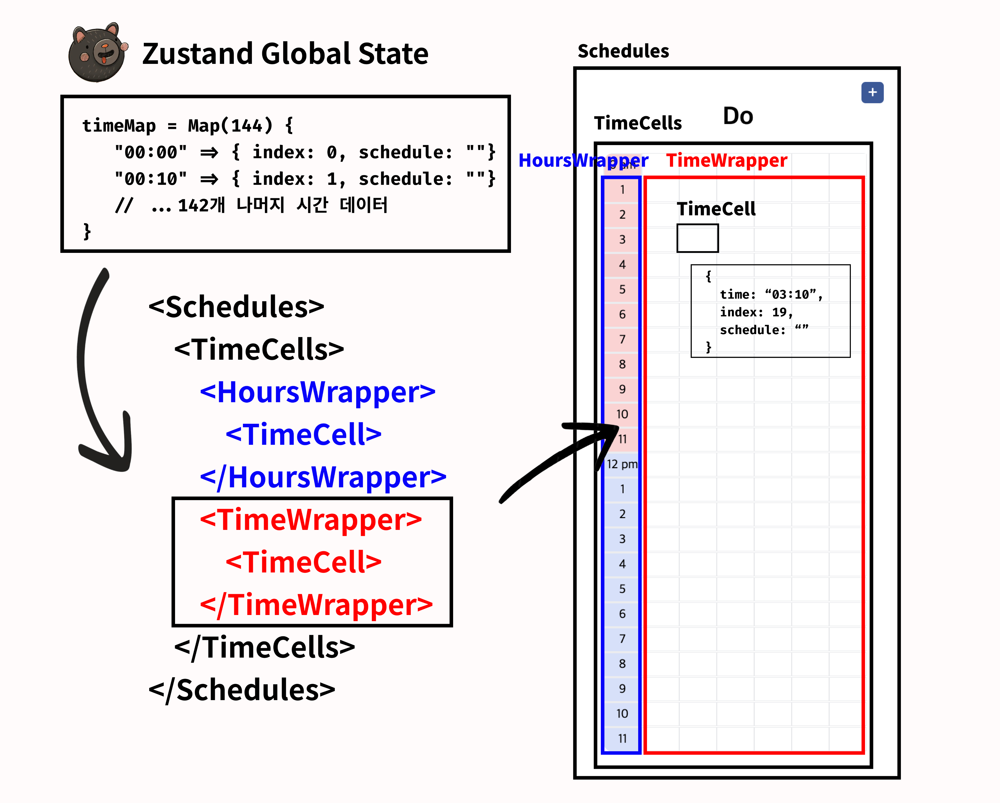

 초기 데이터의 Object구조를 Map 구조로 변경해 키값으로는 시간 문자열을 가지고있고 값으로는 인덱스 정보와 이벤트 정보를 가지고 있게 함으로 목록 렌더링시 생성된 순서를 완벽히 보장하기 때문에 시간의 연속성을 보장할 수 있었고 Object의 특성을 활용할수도 있어서 특정 시간 문자열의 이벤트에 빠르게 접근할 수 있었습니다.

<br />

<h3 id="2-셀의-드래그-기능은-어떻게-구현할-수-있을까?">2. ⇱ 셀의 드래그 기능은 어떻게 구현할 수 있을까?</h3>

사용자가 드래그한 시간 셀의 영역 만큼 시간을 특정지어서 일정을 추가할 수 있도록 드래그 기능을 구현 하면서 아래와 같은 사고 과정을 거쳤습니다.

#### 2.1 아이디어 : 여러가지 마우스 이벤트를 조합한 드래그 핸들러 작성

드래그란 사용자가 특정 요소에 마우스를 클릭한 상태로 움직였다가 떼는 동작으로 여러개의 마우스 이벤트가 발생하면서 이루어지는 동작입니다. 즉 드래그 기능을 구현하기 위해서는 여러 이벤트 핸들러를 조합해서 기능을 구현해야 했음을 의미합니다.

1. **드래그동작 구현을 위해서 여러가지 이벤트를 조합하기**

    일반적으로 드래그 기능 구현을 위해 사용되는 이벤트 조합으로는 크게 3가지가 있음을 확인했습니다.

    | 이벤트 조합 | 장점 | 단점 |
    |-------------|------|------|
    | `onMouseDown`<br>`onMouseMove`<br>`onMouseUp` | - 모든 브라우저에서 호환성 좋음<br>- 마우스 커서 위치 추적 가능<br>- 다양한 마우스 인터랙션 구현 가능 | - 터치 기기에서 작동하지 않음<br>- 마우스 커서가 화면 밖으로 나가면 이벤트 작동 안함<br>- 드래그 앤 드롭 기능을 위해 추가 코드 필요 |
    | `onDragStart`<br>`onDrag`<br>`onDragEnd` | - 드래그 앤 드롭 기능 쉽게 구현 가능<br>- 터치 기기에서도 작동<br>- 마우스 커서가 화면 밖으로 나가도 작동 | - 일부 브라우저에서 기본 동작 방지를 위해 추가 코드 필요<br>- 드래그 앤 드롭 이외의 인터랙션 구현 어려움<br>- 드래그 앤 드롭 기능에 특화 |
    | `onPointerDown`<br>`onPointerMove`<br>`onPointerUp` | - 마우스와 터치 입력 모두 지원<br>- 마우스 커서가 화면 밖으로 나가도 작동<br>- 새로운 입력 장치에도 호환 가능 | - 현재 브라우저 호환성 낮음, 폴리필 필요<br>- 이벤트 객체 속성이 브라우저마다 다를 수 있음<br>- 드래그 앤 드롭 기능을 위해 추가 코드 필요 |


    저는 모바일 환경에서의 대응을 하지 않기 때문에 모든 브라우저에서 호환성이 높은 `onMouseDown`, `onMouseMove`, `onMouseUp` 조합을 사용하여 이벤트 기능을 구현하고자 했습니다.

2. **`onMouseEnter`와 `onMouseMove`의 차이점은 무엇일까?**

    드래그 중일때 이벤트 핸들러를 작성하기 위해서 `onMouseEnter`와 `onMouseMove`의 사용을 고려했었는데 저의 경우에는 드래그 된 요소의 위치를 파악할 필요가 없었고 불필요한 이벤트 핸들링을 피하기 위해서 `onMouseEnter` 이벤트를 선택했습니다.

    | 이벤트 | 특징 |
    |--------|------|
    | `onMouseEnter` | - 드래그 대상 요소에 마우스가 진입했을 때 한 번만 발생. <br />- 불필요한 이벤트 핸들링을 피할 수 있어 성능 저하를 최소화할 수 있음. <br />- 드래그 중인 요소의 실시간 위치를 추적할 수 없음.<br>- 다른 이벤트와 함께 사용해야 하므로, 코드가 복잡해질 수 있음. |
    | `onMouseMove` | - 마우스 커서의 실시간 위치를 추적할 수 있어, 위치를 업데이트에 적합함.<br>- 다른 이벤트 함께 사용하여 드래그 기능을 완벽하게 구현할 수 있음. <br>- 이벤트가 여러번 발생해서 성능 저하가 발생할 수 있음. |

#### 2.2 구현 과정 : 드래그 동작 과정에서 적절한 UI 변경해주기

사용자가 드래그 동작시 발생하는 마우스 이벤트마다 다른 로직을 수행하도록 이벤트 핸들러를 작성해서 이벤트끼리 서로 상호작용해서 UI가 적절히 바뀌어 바뀌어서 사용자가 드래그 된 영역을 알수 있게 했습니다.


  |사용자 동작|사용된 이벤트|동작|
  |------|---|---|
  |드래그 시작|`onMouseDown`|- `useRef`에 시작 인덱스 저장<br />- 드래그 시작 인덱스의 경우 두꺼운 테두리 적용|
  |드래그 도중|`onMouseEnter`|- `useRef`에 종료 인덱스 재할당<br />- 시작 인덱스에 따른 드래그 방향 판별 로직 수행<br />- 드래그 된 영역의 배경색의 명도를 어둡게 적용|
  |드래그 종료|`onMouseUp`|- `useRef`에 종료 인덱스 재할당<br />- `useRef`에 저장된 시작 인덱스와 종료 인덱스로 인덱스 길이와, 인덱스 영역 계산 로직 수행<br />- 드래그 된 영역 배경색 변경 후 작업 선택 모달 렌더링|


#### 2.3 문제 인식: 드래그의 방향을 어떻게 판별 할 수 있을까?

사용자는 드래그를 뒤에서 앞으로 역방향으로 할 수도 있고 앞에서 뒤로 정방향으로할 수도 있는데 역방향으로 드래그 했을때 드래그를 시작하는 인덱스를 다르게 적용해서 드래그 된 영역을 계산하는 로직을 작성해야 했습니다.

  


 
#### 2.4 문제 해결 : `useRef`를 활용해서 인덱스를 저장해서 계산하자

드래그를 시작했을때와 마쳤을때의 인덱스 정보를 `useRef` 를 사용해서 저장하였고 드래그를 마쳤을때 `useRef` 인덱스간 차를 통해서 사용자가 드래그 한 방향을 판별하고 드래그된 영역을 특정 지을 수 있었습니다.
|정방향 드래그 이벤트 추가|역방향 드래그 이벤트 추가|
|----|----|
|||


  ```javascript
  // 정방향 드래그
  const isForwardSelection = timeCell.index > startIndex && timeCell.index > endIndex;

  ...

  // 역방향 드래그
  const isBackwardSelection = timeCell.index < startIndex && timeCell.index < endIndex;

  ...
  ```

- 드래그 시작 인덱스 < 드래그를 마쳤을때 인덱스 => ⬅️ 역방향 드래그 <br />
- 드래그 시작 인덱스 > 드래그를 마쳤을때 인덱스 => ➡️ 정방향 드래그 <br />


<br />

<h3 id="3-시간-셀의-일정-관리는-어떻게-해야할까?">3. 시간 셀의 일정 관리는 어떻게 해야할까?</h3>

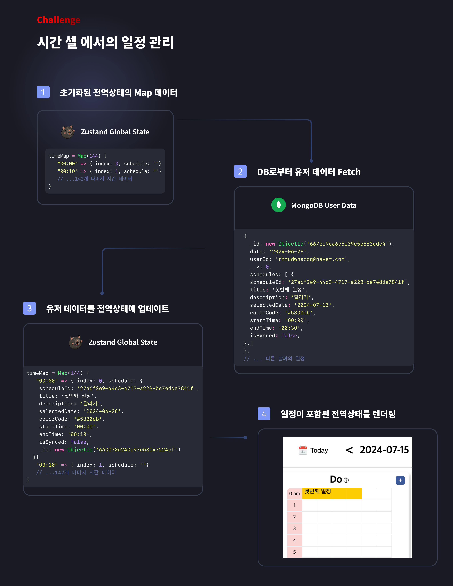

### 3.1 이벤트 관리 : 전역상태로 관리하고 변경사항 발생시 전역상태와 DB에 업데이트

사용자가 시간 셀을 드래그 했을때 이벤트의 유무에 따라서 다른 작업을 선택할 수 있도록 하고자 했습니다. 각 시간 셀마다 이벤트 정보를 가지고 있어야 한다고 판단했습니다.

**그렇다면 이벤트 정보를 어디서 관리해야할까? -> 전역상태에서 관리하자**

시간 셀을 렌더링 하기 위해서 전역 상태의 144개의 인덱스를 가진 Map 데이터를 렌더링 하는데 기존에 사용자가 추가한 일정을 어떻게 함께 렌더링 해야 할지 고민했습니다. 

**사용자의 일정은 어떻게 전역상태에 추가할까? -> 컴포넌트 마운트시 가져오자**

컴포넌트 마운트 시 DB로부터 유저의 데이터를 fetch 해서 전역 상태의 Map 데이터에 사용자의 일정을 업데이트 하는 로직을 수행한뒤 렌더링 합니다.

**구현 결과**

그래서 시간 셀을 렌더링 하면서 사용자 일정을 함께 렌더링 할 수 있게 되고 드래그 이벤트가 발생시 인덱스를 참조해서 이벤트 존재 여부에 따라서 다른 작업을 선택 할 수 있는 모달창을 렌더링 할 수 있었습니다. <br />

### 3.2 UI / UX : Google Sheet에 착안한 이벤트 유무에 따른 작업 모달창 렌더링

### 드래그시 Google Sheet와 Excel에서 UI 변경

셀 구조를 기반으로 동작하는 Google Sheet와 Excel에서 UI가 변경되는 방식을 착안하여서 사용자가 시간 셀을 드래그했을때 드래그 된 영역만큼 UI가 변경되도록 했습니다.

|Google Sheet 셀 드래그 시|PDS Diay 앱에서 셀 드래그 시|
|----|---|
|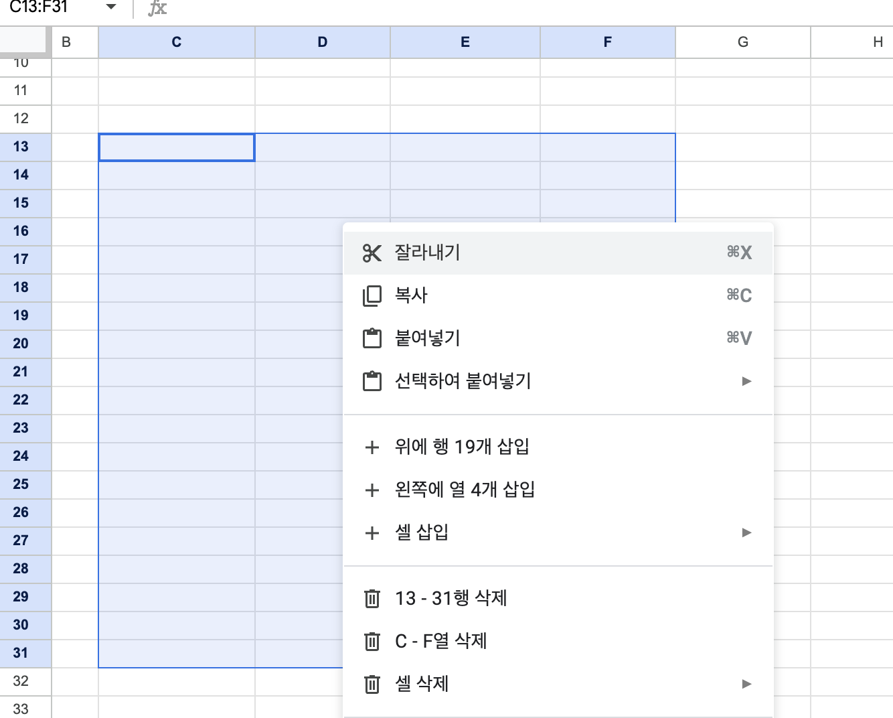|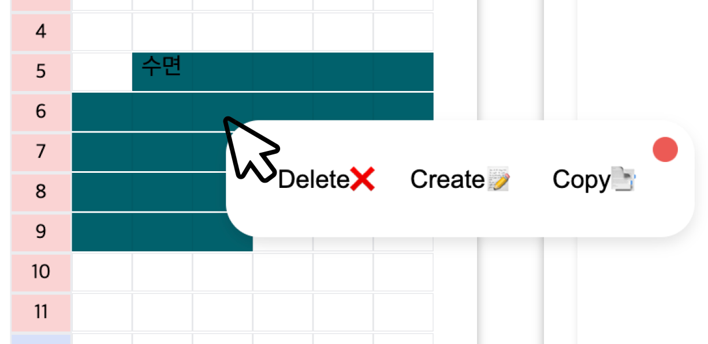|


### 이벤트 유무에 따른 작업 모달창 렌더링

이벤트가 존재하는 경우에는 해당 이벤트를 복사하거나 수정하거나 삭제할 수 있어야 하고, 이벤트가 존재하지 않는 경우에는 이벤트를 새로 추가하거나 기존에 복사한 이벤트를 붙여넣기할 수 있어야 했기 때문에 이벤트의 유무에 따라서 토글창을 다르게 렌더링해서 사용자에게 원하는 작업을 선택할 수 있게 하였습니다.<br />

|이벤트가 존재하는 경우|이벤트가 존재하지 않는 경우|
| ---- | ---- |
|||


### 3.3 예외 케이스 처리 : 중복된 이벤트 추가 방지를 위한 드래그 기능 제한

이벤트가 존재하는 셀에 다른 이벤트가 중복되서 추가되는 상황을 방지하기 위해서 사용자가 이벤트가 존재하는 셀과 존재하지 않은 셀을 같이 선택했을 때 이벤트가 존재하지 않는 셀의 인덱스만 선택되도록 드래그 영역을 제한하는 방법을 생각했습니다.

- **중복된 이벤트 추가 방지를 위해 드래그 영역 제한**<br />
사용자가 드래그 한 영역에 이벤트가 존재하는 셀이 포함되어 있다면 이벤트가 존재하는 셀의 인덱스를 제외한 나머지의 인덱스로 셀을 특정 지음으로 이벤트가 존재하지 않는 셀에서 대해서 작업을 진행할 수 있도록 했습니다.

  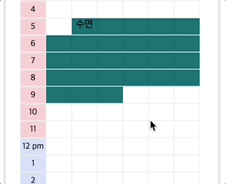

- **이벤트가 존재하는 셀에서 드래그 기능 제한** <br />
이미 추가된 일정에서 드래그를 시작하는 경우 해당 일정에 대한 추가 작업을 진행 할수 있도록 드래그 로직이 작동하지 않고 작업 선택 모달창이 렌더링 되도록 하였고, 일정이 선택된 것을 사용자가 인지할 수 있도록 대응하는 일정의 모든 시간 셀에 UI가 변경되도록 했습니다.


  |일정이 포함된 셀 클릭시 일정이 선택된것처럼 UI 구현|
  |----|
  |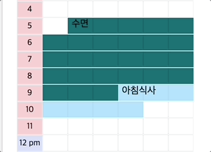|

<br />

<h3 id="4-textEditor-어떻게-구현-할-수-있을까?">4. 📝 textEditor 어떻게 구현 할 수 있을까?</h3>

저는 사용자가 하루의 일과를 회고할 수 있는 간단한 텍스트 편집기를 구현하고자 했습니다. 일반적으로 텍스트 편집기를 구현하기 위해서는 `Quill.js` 와 `Slate.js`, `Draft.js` 등 다양한 라이브러리를 활용한다는 것을 확인했지만 저는 텍스트 에디터가 동작 원리를 학습하고자 직접 Javascript로 구현하고자 했습니다.

#### 4.1 구현 방법 찾기 : `execCommand()`를 사용해서 스크롤 된 텍스트에 스타일 적용하기

- 텍스트 편집 기능을 직접 구현하기 위해 `execCommand()` 를 활용하거나 `window.getSelection()`을 활용해서 사용자가 선택한 텍스트에 스타일을 적용 하는 방법이 있었고 처음에는 러닝커브가 낮고 바로 적용할 수 있다고 판단해서 `execCommand()`를 사용해서 텍스트 편집 기능을 구현하고자 했습니다.

- `execCommand()` 는 브라우저 API에서 제공하는 메서드로 사용자가 선택한 텍스트에 스타일을 적용해서 DOM을 직접 업데이트 하는 방식으로 텍스트에 스타일을 적용 할 수 있었습니다.

#### 4.2 문제 인식 : 상태 변화를 통하지 않고 직접적인 DOM조작은 리액트에서 권장하는 방식이 아니다.

- `execCommand()`를 사용해서 텍스트 편집 기능을 구현하는데는 기술적으로 큰 어려움은 없었고 비교적 로직도 간단히 작성 할 수 있었으나 다음과 같은 이유로 다른 대안을 찾아야 했습니다.

1. React는 직접적으로 DOM을 조작하지 않고, 상태 변경을 통해서 Virtual DOM을 업데이트하고, 리렌더링 함으로서 실제 DOM에 변경사항이 반영되어서 리렌더링으로 UI가 변경되는 방식을 권장합니다.

2. `execCommand()` 는 deprecated 된 메서드로 현재 많이 사용하기 때문에 지원이 중단 될일은 거의 없다고 확인 했지만 향후 호환성 이슈를 발생 시킬 수 있는 여지가 있었습니다.

#### 4.3 문제 해결 : `window.getSelection()`을 사용해서 스타일 적용 후 DOM String 을 상태로 관리하기 

- 기존에 `execCommand()` 를 사용해서 DOM 객체에 직접 스타일을 적용해서 UI를 변경 하는 방법에서 리액트 친화적인 방법으로 사용자가 선택한 텍스트에 스타일을 적용 한 뒤 DOM String을 상태로 관리해서 리렌더링으로 UI가 변경되는 방식으로 변경하고자 했습니다.

- `execCommand()` 대안으로 사용할 수 있는 방법으로는 브라우저 API에서 제공하는 `window.getSelection()` 과 `range` 객체를 사용해서 스크롤된 텍스트의 위치를 특정지을 수 있었고 스타일이 적용된 태그를 입힌 다음 DOM String를 상태로 관리해서 리렌더링 되게 하였습니다.

`window.getSelection()` 과 `range`를 사용해서 스타일을 적용하는 간단한 예시 코드 입니다.

```js
function onTextSelect() {
  // 현재 선택된 텍스트 정보를 가져옵니다.
  const selection = window.getSelection();
  
  if (selection.rangeCount > 0) {
    // 선택된 텍스트의 범위를 가져옵니다.
    const range = selection.getRangeAt(0);
    
    // <span> 요소에 스타일을 적용
    const newNode = document.createElement("span");
    newNode.style.fontWeight = "bold";
    
    // 선택된 텍스트를 <span> 요소로 감싼다.
    range.surroundContents(newNode);
    
    selection.removeAllRanges();
  }
}
```

#### 4.4 구현 결과 : 부분적인 텍스트 편집 기능 구현 및 엣지케이스에 따른 추가 로직 필요

**구현 결과**
1. 라이브러리 의존 없이 Javascript로 직접 구현하면서 브라우저의 작동 원리와 텍스트 편집 동작 원리에 대해 이해할 수 있었습니다.

2. 사용자가 선택한 텍스트에 스타일을 적용해서 상태로 관리해서 리렌더링 하므로 단일 스타일을 적용하고 해제하는 기능을 구현할 수 있었습니다.

**추가 문제 발생**
- 텍스트에 스타일을 적용하는 경우에 텍스트 박스에 Caret이 해제되는 이슈 발생
- 스타일이 중첩된 텍스트에 스타일을 해제할 때 에러 발생
- 개행이 포함된 문자열에 스타일 적용할 때 개행 해제되는 이슈 발생
- 복잡한 코드 구조에 따라서 유지보수의 비용이 증가해 리팩터링의 필요성 대두

**개선할 점**

1. 사용자가 텍스트에 스타일을 적용할하는 다양한 경우(개행이 포함된 텍스트의 경우, 다른 스타일 태그로 감싸진 텍스트에 스타일을 적용하는 경우 등)를 고려해서 엣지케이스에 따른 추가 로직 작성이 필요합니다.

2. 예상했던것보다 상태 관리를 통해 텍스트 편집 기능을 직접 구현하기 위해서는 고려해야 할 엣지 케이스가 많았고, 텍스트 스타일 적용 함수를 모듈로 분리하는 등추후 지속적인 리팩터링과 기능 개선이 필요합니다.

<h2 id="개발-일정">🗓️ 개발 일정</h2>

#### 핵심 개발 기간: 2024.03.04(월) ~ 2024.03.27(수) (3주)
<br />

#### 1주차
- [칸반 보드 작성](https://sand-tapir-46f.notion.site/Solo-Project-0967a6d7b7344b0bbfc47ac22b39bfb5?pvs=4)
- [프로젝트 아이디어 선정](https://sand-tapir-46f.notion.site/8f6f3f192c584ef38824ffdef4c0f4c0?pvs=4)
- [POC 기술 검증](https://sand-tapir-46f.notion.site/POC-7abb3e99592e4a1a82aae5a94edc6a47?pvs=4)
- [피그마 목업 작성하기](https://www.figma.com/design/ZrmPxIyvJ86oDDIrFTOfJz/P.D.S-Diary-Flow-Chart?node-id=0-1&t=fxTjs4QNjWqcgYsk-1)
- [API 명세서 작성](https://sand-tapir-46f.notion.site/API-4dc6e5c4d71d4107a4a64998141c417f?pvs=4)
- [MongoDB 스키마 구조 설계](https://lucid.app/lucidchart/206868d1-f324-4421-81e7-21dabd689e72/edit?viewport_loc=-1399%2C-410%2C1257%2C1784%2C0_0&invitationId=inv_642d7865-4d91-4b52-8975-c0327b1ed357)

#### 2주차
- Zustand 글로벌 상태 정규화
- 로그인 기능 구현
- 라우터 작성, 서비스 메인 컴포넌트 개발
- 시간 셀 드래그 기능 구현
- 일정 CRUD 기능 구현

#### 3주차
- 클라이언트 AWS S3 + CloudFront 배포
- 서버 AWS CodePipeline + ElasticBeanstalk 배포
- Git Action을 사용한 CI/CD 배포 자동화 설정 

#### ~ 현재까지
- 컴포넌트 단위별 테스트 코드 작성
- Typescript 마이그레이션 예정
- 모바일 대응 및 구글 Analytics 적용

<h2 id="프로젝트-회고">✍️ 프로젝트 회고</h2>

<details><summary>고경준</summary>
개인 프로젝트는 기획부터 배포 운영까지 모두 혼자서 책임져야 했었기 때문에 기획했던 일정에 차질이 생기지 않도록 시간관리에 중요성에 대해서 배우게 되었습니다.

<br />

일상속에서 매일 당연하게 사용했던 텍스트 편집기나 드래그 기능안에는 편리한 UI/UX를 위해서 수많은 경우들을 고려해서 개발된 기능이라는것을 알 수 있었고, 작은 기능 하나를 구현하더라도 사소한 경우까지 모두 고려해서 사용자가 불편함을 인식하지 못할정도로 세심하게 UI/UX를 기획해야 한다는것을 배울 수 있었습니다.

<br />

평소 개발을 할때 `왜` 라는 질문보다 `어떻게` 해야할지 방법론 적인 부분을 먼저 생각했었는데 이번 프로젝트를 계기로 `왜` 라는 질문을 먼저 하면서 방법을 찾기까지의 체계적이고 논리적인 사고 과정이 반드시 필요하다는것을 배울 수 있었습니다.

<br />

</details>