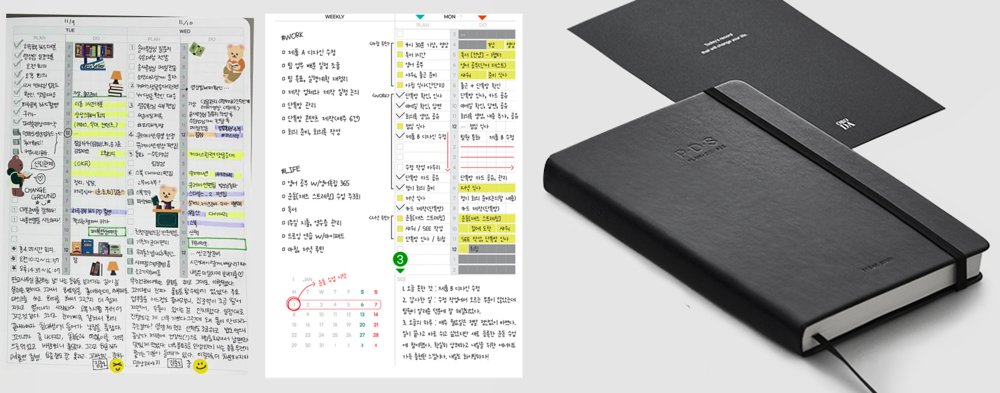
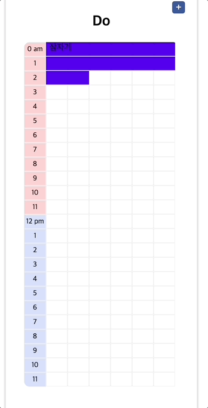
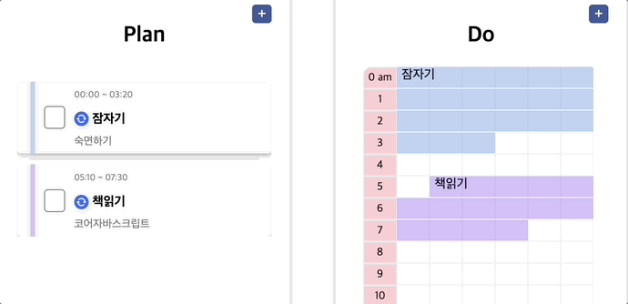
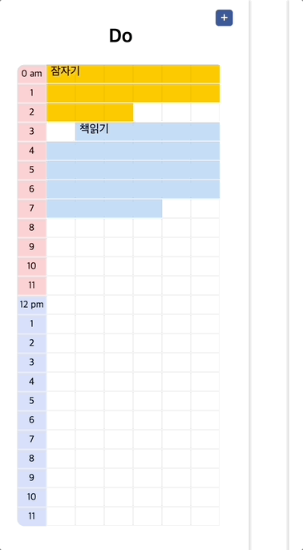
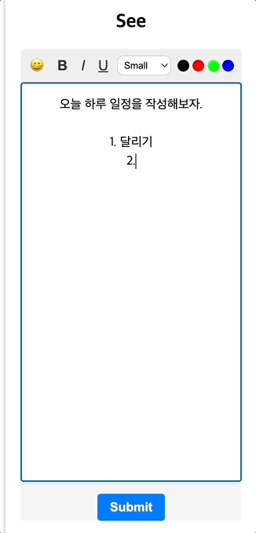
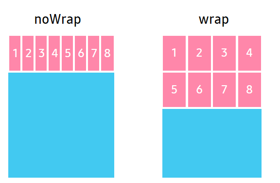

# PDS Diary


PDS 다이어리는 하루 24시간을 10분 단위로 일정을 관리 할 수 있는 다이어리 웹 앱입니다.

<hr>

### 🔗 Depoly URL : https://www.pdsdiary.com

<br />

## 💼 목차
- ### [🚀 기술 스택](#🚀-기술-스택)
- ### [💡 기획 동기](#💡-기획-동기)
- ### [⚒️ 기능 소개](#⚒️-기능-소개)
- ### [🔥 기술 챌린지](#🔥-기술-챌린지)
  - [1. ⏱️ 10분 단위의 시간 셀을 어떻게 렌더링 할 수 있을까?](#1-10분-단위의-시간-셀을-어떻게-렌더링-할-수-있을까?)
    - [1.1 초기 접근 방식 : 렌더링 구조를 고려해서 1시간을 24번 반복 렌더링 하기](#11-아이디어--1시간-단위로-24번-렌더링-하기)
    - [1.2 문제 인식 : 다음 행으로 넘어가는 시간셀에 연속적인 드래그 기능 구현의 어려움](#12-문제-인식--반복되는-이벤트-핸들러-전달로-인한-가독성-저하)
    - [1.3 해결 방안 모색 : 144개의 시간정보를 가진 데이터 반복 렌더링](#13-해결-방안-모색--144개의-시간정보를-가진-map-데이터-반복-렌더링)
    - [1.4 구현 결과 : Map을 활용한 빠른 데이터 조회와 생성 순서 보장](#14-구현-결과--빠른-데이터-조회와-시간의-순서-보장)
  - [2. ⇱ 셀의 드래그 기능은 어떻게 구현할수 있을까?](#2-셀의-드래그-기능은-어떻게-구현할-수-있을까?)
    - [2.1 아이디어 : 여러가지 이벤트를 조합해서 적절한 UI 변경해주기](#21-아이디어--여러가지-이벤트를-조합해서-적절한-ui-변경해주기)
    - [2.2 문제 인식: 드래그의 방향을 어떻게 판별 할 수 있을까?](#22-문제-인식-드래그의-방향을-어떻게-판별-할-수-있을까)
    - [2-3 문제 해결 : `useRef`를 활용해서 인덱스를 저장해서 계산하자](#2-3-문제-해결--useref를-활용해서-인덱스를-저장해서-계산하자)
  - [3. 시간 셀의 일정 관리는 어떻게 해야할까?](#3-시간-셀의-일정-관리는-어떻게-해야할까?)
  - [4. 📝 textEditor 어떻게 구현 할 수 있을까?](#4-textEditor-어떻게-구현-할-수-있을까?)
    - [4.1 아이디어 : `execCommand()`를 사용해서 스크롤 된 텍스트에 스타일 적용](#41-아이디어--execcommand를-사용해서-스크롤-된-텍스트에-스타일-적용하기)
    - [4.2 문제 인식 : 직접적인 DOM조작은 리액트에서 권장하는 방식이 아니다?!](#42-문제-인식--상태-변화를-통하지-않고-직접적인-dom조작은-리액트에서-권장하는-방식이-아니다)
    - [4.3 문제 해결 : `window.getSelection()`을 사용한 스타일 변경후 상태관리](#43-문제-해결--windowgetselection을-사용해서-스타일-변경후-상태로-관리하기)
    - [4.4 해결 결과 : 유지보수 비용 절약을 위해 적절한 라이브러리 사용 필요](#44-해결-결과--장기적으로-기능-추가시-유지보수-비용-절약을-위해-적절한-라이브러리-사용-필요)

- ### [✍️ 회고](#✍️-회고)

<br />

## 🚀 기술 스택

### FrontEnd
<div style="display:flex;">
  &nbsp;
  &nbsp;
  &nbsp;
  &nbsp;
</div>

### BackEnd

<div style="display:flex;">
  &nbsp;
  &nbsp;
  &nbsp;
  
</div>

<br />

## 💡 기획 동기

개인 프로젝트 주제로는 제가 활용성 있게 사용했던 시중에 발매되어 있는 PDS 다이어리를 웹으로 구현하고자 했습니다. 

### 1. PDS 다이어리의 장점



제가 직접 다이어리를 사용하면서 다른 다이어리들과 차이점이자 PDS 다이어리만의 장점이라고 생각했던 부분은 아래와 같습니다.

1. 10분 단위의 일정 관리 : 30분, 1시간 단위의 시간관리가 아닌 10분 단위의 일정 관리가 가능하여서 하루동안 주어진 시간을 더욱 집약적으로 활용 할 수 있습니다.
2. 직관적인 레이아웃 디자인 : 체크 리스트와, 24시간이 셀로 이루어져 있는 시간 일정표를 통해서 자신이 그날 무슨일을 했고 하지 못했는지 시각적으로 직관적으로 파악할 수 있었습니다.
3. 회고를 통한 빠른 피드백 : 페이지마다 간단히 하루 일과를 회고할 수 있도록 글자를 쓸 수 있는 무선 칸 영역이 있어 짧게 글을 작성하기도 좋고 하루 일과를 피드백을 통해 일정 관리 효율을 개선 할 수 있었습니다.

### 2. 프로젝트의 목표

이번 프로젝트를 통해서 달성하고자 했던 목표로는 크게 2가지가 있었습니다.

<br />

  > 1. 웹으로 다이어리 서비스를 개발할때 사용자 경험을 위한 고민
  >
  > 2. 텍스트 편집기 & 드래그 기능을 직접 구현을 통한 원리 이해


#### 1. 웹으로 다이어리 서비스를 개발할때 사용자 경험을 위한 고민
- 다이어리를 웹으로 개발하고자 할때 편리한 사용자 경험을 제공하기 위해서 어떤 점을 고려해야 하는지 고민하면서 사용자 경험 중심으로 개발할 수 있는 경험이 될것이라고 생각했습니다. <br />

- 웹에서 다이어리를 작성하고자 할때 편리한 UI/UX 제공을 위해서 다음과 같은점을 어필할 수 있다고 생각했습니다. <br />

  **1.1 편리한 시간 선택 :** 기존의 일정 관리 웹 앱 같은 경우에는 사용자가 일정의 시간을 일일히 지정해야 하지만
시간 셀을 드래그해서 자동으로 시간을 특정 지어서 일정을 추가할수 있게 하고자 했습니다.

  **1.2 반복된 일정의 추가 기능 :** 사용자가 매일 반복된 일정을 추가하고자 할때 시간과 일정 내용을 일일히 기록하지 않아도 이미 추가된 일정을 재사용 할수 있도록 복사 기능을 구현하고자 했습니다.

  **1.3 하루 일정 회고 기능 :** 사용자가 하루의 일정을 회고 하기 위해서 간단한 글을 작성할수 있도록 간단한 스타일을 적용할수 있는 텍스트 편집기 기능을 함께 구현하고자 했습니다.

<br />

#### 2. 텍스트 편집기 & 드래그 기능을 직접 구현을 통한 원리 이해

어쩌면 일상속에서 가장 흔하게 사용하고 있던 드래그, 텍스트 편집기 기능이 어떤 원리로 동작이 되는지 궁금했습니다. 그래서 사용자의 입장이 아닌 개발자의 입장으로서 해당 기능을 구현하기 위해서 어떤점을 고려해야 하고 어떤 원리로 동작되는지 이해하고자 Javascript 로 직접 구현하고자 했습니다.

<br />

## ⚒️ 기능 소개

### 1) 스케줄 복사 기능
<details>
  <summary>🎥 시연 영상</summary>
  <p>
    
  </p>
</details>

→ 사용자가 추가한 스타일과 일정을 특정 시간에 붙여넣기 할 수 있습니다.<br />
> 클립보드에 복사된 이벤트가 있으면 붙여넣기 할수있는 버튼이 렌더됩니다.<br />
> 추가하려는 시간에 기존 이벤트가 존재하면 에러 토스트가 렌더링됩니다.
<br />

### 2) 일정 연동 기능

<details>
  <summary>🎥 시연 영상</summary>
  <p>
    
  </p>
</details>

→ 사용자가 Plan 섹션에서 일정 추가시 연동 버튼을 누르면 Do 섹션의 동일한 시간에 이벤트가 추가되고 일정이 변경되는 경우 동기화되어서 적용됩니다.<br />
> 빨간색 테두리는 이전 버전과 대비하여 이후버전에서 변경사항이 생긴 요소 입니다. <br />
> 초록색 테두리는 이전 버전에는 존재하지 않았으나, 이후 버전에서 새롭게 추가된 요소입니다.

<br />

### 3) 일정 삭제 기능

<details>
  <summary>🎥 시연 영상</summary>
  <p>
    
  </p>
</details>

→ Do 섹션에서 일정 삭제시 해당 일정에 해당하는 모든 시간 셀이 선택되고 일정을 삭제하거나 수정할수 있습니다. <br />
> 일정 선택시 작업을 선택할수 있는 모달창이 렌더 됩니다. <br />
> 기존에 복사된 일정이 있더라도 복사된 일정을 덮어쓰기 할 수 있습니다. <br />

### 4) 텍스트 편집 기능

<details>
  <summary>🎥 시연 영상</summary>
  <p>
    
  </p>
</details>

→ See 섹션에서 사용자가 하루 일정에 대한 리뷰를 작성 할 수 있습니다.<br />
> 사용자가 선택한 글자의 영역에 스타일이 적용됩니다.<br />
> 기존에 복사된 일정이 있더라도 복사된 일정을 덮어쓰기 할 수 있습니다. <br />

<br />

## 🔥 기술 챌린지

<h3 id="1-10분-단위의-시간-셀을-어떻게-렌더링-할-수-있을까?">1. ⏱️ 10분 단위의 시간 셀을 어떻게 렌더링 할 수 있을까?</h3>

#### 1.1 초기 접근 방식 : 렌더링 구조를 고려해서 1시간을 24번 렌더링 하기
> 1시간을 10분 간격으로 6칸으로 나눈 `Array` 를 24번 반복 렌더링 하기

처음에는 24시간을 6 * 24 의 표 형태로 렌더링 하기 위해서 10분단위로 6칸으로 나누어진 1시간 셀을 세로로 24번 반복 렌더링 하고자 했습니다.

그래서 저는 24개의 요소를 가진 배열형태를 고려했었고 각 요소를 Object 형태로 key값으로는 시간 문자열을 가지고 value값으로는 10분 간격의 시간데이터를 배열로 가지게 데이터를 구상했었습니다.


```js
const time = [
  { "01:00": [0, 10, 20, 30, 40, 50] },
  { "02:00": [0, 10, 20, 30, 40, 50] },
  // ... 22개의 나머지 시간들
];
```

<br />

#### 1.2 문제 인식 : 다음 행으로 넘어가는 시간셀에 연속적인 드래그 기능 구현의 어려움
  - 시간마다 데이터를 반복 렌더링 할때마다 공통으로 사용되는 이벤트 핸들러를 Prop으로 추가 해주어야 하기 때문에 코드의 가독성이 낮아진다고 판단했습니다.
  - 시간 셀을 드래그 하여서 시간을 연속적으로 선택 할 수 있어야했는데 다음 행으로 넘어가는 시간의 시간을 특정 짓기 위해서 time 배열 데이터를 다시 순회해서 시간의 연속성을 추가 로직이 필요했습니다.

<br />

#### 1.3 해결 방안 모색 : 144개의 시간정보를 가진 Map 데이터 반복 렌더링

> 24시간을 10분으로 나눈 144개의 요소를 가진 `Object` 를 반복 렌더링 하기

기존의 24개의 요소를 가진 Array를 순회하며 반복 렌더링 하는 방법에서 144개의 요소를 가진 Object를 반복 렌더링 하는 방법으로 변경하였습니다.

각 요소의 key 값으로는 시간 셀이 있고 value 값으로는 시간정보와, 이벤트 정보를 가지고 있는 object 를 넣어줌으로서 연속적인 시간을 렌더링 하므로 드래그 기능을 구현하기 편리할것이라고 생각했습니다.


```js
const time = {
  "00:00" : { time: "00:00", event: null },
  "00:10" : { time: "00:10", event: null },
  // ... 142개의 나머지 시간들
}
```



- 하나의 행에는 6칸이 넘어가는 경우 다음 행으로 줄바꿈 되어서 시간 셀이 렌더링 되게 하기 위해서 하나의 행에 width 값을 지정해서 `flex-wrap: wrap` CSS 속성을 추가해서 한 행의 가로 길이를 넘어가면 다음줄로 줄바꿈 되서 렌더링 되도록 하였습니다.


🚫 문제 발생

```js
const time = {
  "00:00" : { time: "00:00", event: null },
  "00:10" : { time: "00:10", event: "3km 달리기" },
  // ... 142개의 나머지 시간들
}

function getEventByTime(targetTime) {
  const entries = Object.entries(time);

  // Objcet 객체를 한번더 순회하며 O(n)의 시간복잡도를 가짐.
  const [time, event] = entries.find([key, value] => key === targetTime);
  
  return event;
}

console.log(getEventByTime("00:00")); // null
console.log(getEventByTime("00:10")); // "3km 달리기"

```

  - Object는 인덱스가 없으므로 특정 시간을 가진 키값의 데이터에 접근하기 위해서 한번 더 객체를 순회하기 떄문에 빠르게 데이터를 조회할 수 있는 Object의 특징을 활용할 수 없었습니다.
  
  - 특정 시간의 이벤트에 변동사항이 생기는 경우 해당 객체의 키값을 재할당 후 렌더링 할때 Object는 시간의 연속성을 보장할수 없는 문제가 발생했습니다.


✅ 문제 해결
  - Object의 장점을 활용하면서도 객체의 생성순서를 보장하는 Map 자료구조를 활용했습니다.

<br />

#### 1.4 구현 결과 : 빠른 데이터 조회와 시간의 순서 보장 

> Object는 생성된 순서를 보장하는 Map 데이터 반복 렌더링 하기

  - 시간 데이터를 Map 구조로 변경해 인덱스마다 시간셀의 정보를 가지게 하여서 목록 렌더링시 시간의 연속성을 보장 할 수도 있고 Object의 특성을 사용 해서 특정 인덱스의 시간에 빠르게 접근할 수 있었습니다.

<br />

<h3 id="2-셀의-드래그-기능은-어떻게-구현할-수-있을까?">2. ⇱ 셀의 드래그 기능은 어떻게 구현할수 있을까?</h3>

사용자가 드래그한 시간 셀의 영역 만큼 시간을 특정지어서 일정을 추가할수 있게 하기 위해서 드래그 기능을 구현 하면서 아래와 같은 사고 과정을 거쳤습니다.

#### 2.1 아이디어 : 여러가지 이벤트를 조합해서 적절한 UI 변경해주기

1. **드래그동작 구현을 위해서 여러가지 이벤트를 조합하기**
    > 드래그란 사용자가 마우스를 클릭한 상태로 움직였다가 떼는 동작으로 여러개의 이벤트로 구성되어 있습니다.
    > 
    > 즉, 드래그 동작시 발생하는 각각의 이벤트에 따라 적절하게 UI가 바뀌어야 함을 의미합니다.

  #### 어떤 이벤트를 조합하는게 좋을까?
- 드래그 기능에 사용되는 이벤트 조합으로는 크게 3가지가 있음을 확인했습니다.

| 이벤트 조합 | 장점 | 단점 |
|-------------|------|------|
| `onMouseDown`<br>`onMouseMove`<br>`onMouseUp` | - 모든 브라우저에서 호환성 좋음<br>- 마우스 커서 위치 추적 가능<br>- 다양한 마우스 인터랙션 구현 가능 | - 터치 기기에서 작동하지 않음<br>- 마우스 커서가 화면 밖으로 나가면 이벤트 작동 안함<br>- 드래그 앤 드롭 기능을 위해 추가 코드 필요 |
| `onDragStart`<br>`onDrag`<br>`onDragEnd` | - 드래그 앤 드롭 기능 쉽게 구현 가능<br>- 터치 기기에서도 작동<br>- 마우스 커서가 화면 밖으로 나가도 작동 | - 일부 브라우저에서 기본 동작 방지를 위해 추가 코드 필요<br>- 드래그 앤 드롭 이외의 인터랙션 구현 어려움<br>- 드래그 앤 드롭 기능에 특화 |
| `onPointerDown`<br>`onPointerMove`<br>`onPointerUp` | - 마우스와 터치 입력 모두 지원<br>- 마우스 커서가 화면 밖으로 나가도 작동<br>- 새로운 입력 장치에도 호환 가능 | - 현재 브라우저 호환성 낮음, 폴리필 필요<br>- 이벤트 객체 속성이 브라우저마다 다를 수 있음<br>- 드래그 앤 드롭 기능을 위해 추가 코드 필요 |


저는 모바일 환경에서의 대응을 하지 않기 때문에 모든 브라우저에서 호환성이 높은 `onMouseDown`, `onMouseMove`, `onMouseUp` 조합을 사용하여 이벤트 기능을 구현하고자 했습니다.

드래그 중일때 이벤트 핸들러를 작성하기 위해서 `onMouseEnter`와 `onMouseMove`의 사용을 고려했었는데
| 이벤트 | 특징 |
|--------|------|
| `onMouseEnter` | - 드래그 대상 요소에 마우스가 진입했을 때 한 번만 발생. <br />- 불필요한 이벤트 핸들링을 피할 수 있어 성능 저하를 최소화할 수 있음. <br />- 드래그 중인 요소의 실시간 위치를 추적할 수 없음.<br>- 다른 이벤트와 함께 사용해야 하므로, 코드가 복잡해질 수 있음. |
| `onMouseMove` | - 마우스 커서의 실시간 위치를 추적할 수 있어, 위치를 업데이트에 적합함.<br>- 다른 이벤트 함께 사용하여 드래그 기능을 완벽하게 구현할 수 있음. <br>- 이벤트가 여러번 발생해서 성능 저하가 발생할 수 있음. |

저는 불필요한 이벤트 핸들링을 피하기 위해서 onMouseEnter를 사용했습니다.

2. 각각의 이벤트 핸들러가 상호작용을 하며 UI가 적절히 바뀌어야한다.

  ### 드래그 동작 과정에 따라서 어떤 로직을 수행해야 할까?
- 드래그의 동작과정을 크게 3가지로 분류해서 이벤트 핸들러를 작성했습니다.

|사용자 동작|사용된 이벤트|동작|
|------|---|---|
|드래그 시작|onMouseDown|- `useRef`에 시작 인덱스 저장|
|드래그 중|onMouseMove|- 시작인덱스에 따른 드래그 방향 로직 수행<br />- 드래그된 영역 배경색 변경|
|드래그 종료|onMouseUp|- 시작인덱스와 종료시점 인덱스 차이 계산<br />- 드래그된 영역 배경색 변경|

  - 브라우저에서 제공하는 마우스 이벤트마다 다른 로직을 수행하도록 드래그 핸들링을 작성해서 드래그중에 UI가 변경됨에 따라서 사용자가 드래그 된 영역을 알수 있게 했습니다.

#### 2.2 문제 인식: 드래그의 방향을 어떻게 판별 할 수 있을까?
 

 사용자는 드래그를 뒤에서 앞으로 역방향으로 할 수도 있고 앞에서 뒤로 정방향으로 할수도 있는데 역방향으로 드래그 했을때 드래그를 시작하는 인덱스를 다르게 적용해서 드래그 된 영역을 계산하는 로직을 작성해야 했습니다.
 
#### 2-3 문제 해결 : `useRef`를 활용해서 인덱스를 저장해서 계산하자
  - 드래그를 시작했을때 선택된 인덱스 정보를 `useRef` 를 사용해서 저장하게 하였고 드래그를 마쳤을때 인덱스 차를 구해서 사용자가 드래그 한 시간을 특정 지을 수 있었습니다.
```javascript
// 정방향 드래그
const isForwardSelection = timeCell.index > startIndex && timeCell.index > endIndex;

...


// 역방향 드래그
const isBackwardSelection = timeCell.index < startIndex && timeCell.index < endIndex;

...
```

  - 드래그를 처음 시작한 인덱스를 기준으로 드래그를 마쳤을때 인덱스의 크기를 비교해서 역방향인지 정방향인지 판단하였습니다.

    - 드래그 시작 인덱스 < 드래그를 마쳤을때 인덱스 => ⬅️ 역방향 드래그 <br />
    - 드래그 시작 인덱스 > 드래그를 마쳤을때 인덱스 => ➡️ 정방향 드래그 <br />

<br />


<h3 id="3-시간-셀의-일정-관리는-어떻게-해야할까?">3. 시간 셀의 일정 관리는 어떻게 해야할까?</h3>

144개의 인덱스를 가진 시간정보 Map 데이터를 전역상태로 관리하여서 각각의 셀의 인덱스마다 이벤트 정보와 시간셀의 정보를 가지고 있어서 이벤트가 존재 여부에 따라서 다른 작업을 선택할수 있도록 하였습니다.<br />

|이벤트가 존재하는 경우|이벤트가 존재하지 않는 경우|
| ---- | ---- |
|||

- **이벤트 변동시** <br />
 특정 시간 셀의 이벤트 변동시 전역상태로 관리하고있는 시간정보 Map 데이터를 업데이트 하여서 리렌더링 되어서 변경된 일정이 적용됩니다.
 
- **이벤트 선택시** <br />
  이벤트가 존재하는 시간셀을 선택했을때 이벤트의 시작시간 인덱스와 종료시간의 인덱스의 차이를 구해서 해당 인덱스에 해당하는 시간셀의 스타일을 다르게 적용해서 이벤트가 전체 선택되는 UI를 구현했습니다.

<br />

<h3 id="4-textEditor-어떻게-구현-할-수-있을까?">4. 📝 textEditor 어떻게 구현 할 수 있을까?</h3>

저는 사용자가 하루의 일과를 회고할수 있는 간단한 텍스트 편집기를 구현하고자 했습니다. 텍스트 편집기를 구현하기 위해서는 `Quill.js` 와 `Slate.js`, `Draft.js`  등 다양한 라이브러리가 있음을 확인했습니다 하지만 저는 텍스트 에디터가 동작하는 원리를 학습하고자 직접 Javascript로 구현하면서 다음과 같은 사고 과정을 거쳤습니다.

#### 4.1 구현 방법 찾기 : `execCommand()`를 사용해서 스크롤 된 텍스트에 스타일 적용하기
- 텍스트 편집 기능을 구현하기 위해서는 사용자가 스크롤한 텍스트 영역에 스타일을 적용해야 했습니다.
- 브라우저 API에서는 텍스트에 스타일을 적용할 수 있는 편집 기능을 지원하는 `execCommand()` 메서드를 제공하고 있었습니다.

#### 4.2 문제 인식 : 상태 변화를 통하지 않고 직접적인 DOM조작은 리액트에서 권장하는 방식이 아니다.
예상보다 execCommand()를 사용해서 텍스트 편집 기능을 구현하는데는 기술적으로 큰 어려움은 없었으나 다음과 같은 이유로 대안을 찾아야 했습니다.

1. React에서는 직접적으로 dom을 조작하기 보다 상태 변경을 통해 Virtual DOM을 업데이트하고, 리렌더링 함으로서 실제 DOM을 업데이트해서 UI를 렌더링하는 것을 권장합니다.
2. `execCommand()` 는 deprecated 된 메서드로 향후 호환성 이슈를 방지하게 위해 다른 대안을 찾아야 했습니다.

#### 4.3 문제 해결 : `window.getSelection()`을 사용해서 스타일 변경후 상태로 관리하기 

- `execCommand()` 를 사용해서 직접 DOM에 스타일을 적용하는 방법에서 상태관리를 통해 스타일이 적용하는 방법으로 변경하고자 했습니다.

- 대안으로 사용할 수 있는 방법으로는 브라우저 API에서 제공하는 `window.getSelection()` 과 `range`를 사용해서 스크롤된 텍스트의 위치를 특정지어서 스타일 태그를 적용할수 있었습니다.


`window.getSelection()` 과 `range`를 사용한 간단한 예시 코드입니다.

```js
function onTextSelect() {
  // 현재 선택된 텍스트 정보를 가져옵니다.
  const selection = window.getSelection();
  
  if (selection.rangeCount > 0) {
    // 선택된 텍스트의 범위를 가져옵니다.
    const range = selection.getRangeAt(0);
    
    // <span> 요소에 스타일을 적용
    const newNode = document.createElement('span');
    newNode.style.fontWeight = 'bold';
    
    // 선택된 텍스트를 <span> 요소로 감싼다.
    range.surroundContents(newNode);
    
    selection.removeAllRanges();
  }
}
```

#### 4.4 해결 결과 : 장기적으로 기능 추가시 유지보수 비용 절약을 위해 적절한 라이브러리 사용 필요

**➡️ 구현 결과**
> 1. 라이브러리 의존 없이 직접 구현하면서 Javascript 와 브라우저의 동작원리에 대한 이해도를 높일수 있었습니다.
>
> 2. 부분적으로 텍스트를 상태관리를 통해서 1개의 단일 스타일을 적용하고 해제하는 기능을 구현 할수 있었습니다.

**🚫 추가 문제 발생**
- 마지막으로 텍스트를 작성한 위치의 Caret 위치 저장 이슈 발생
- 스타일이 중첩되에서 텍스트에 적응될 경우 스타일 해제 에러 발생
- 개행이 포함된 문자열에 스타일 적용시 개행 해제되는 이슈 발생
- 스티커 기능, 이미지 삽입기 능 등 기능을 추가할때 유지보수가 어려움

**향후 개선책**

> 아래와 같은 이유로 텍스트 편집기능이 서비스의 주요 기능이 아니라고 한다면 라이브러리를 사용하거나 `execCommand()` 메서드를 제한적으로 사용해서 리팩터링 하는것이 장기적으로 기능 추가를 염두해두고 있는 저의 상황에서 더 적합하다고 판단했습니다.

1. 예상했던것보다 상태관리를 통해 텍스트 편집기능을 직접 구현하기 위해서는 고려해야 하는 엣지 케이스가 많다.
2. 엣지 케이스를 대응을 위한 로직이 추가됨에 따라서 코드 가독성이 저하되고 유지보수가 어려워 진다.


## 🗓️ 개발 일정
프로젝트 기간: 2024.03.04(월) ~ 2024.03.27(수) (3주) <br />
<br />
1주차 : 아이디어 선정, POC, API 명세서, DB 스키마 설계 <br />
2주차 : 클라이언트 구현 및 서버 구현 <br />
3주차 : 클라이언트, 서버 배포 및 CI/CD 배포 자동화 설정 <br />

## ✍️ 회고

<details><summary>고경준</summary>
개인 프로젝트는 기획부터 배포 운영까지 모두 혼자서 책임져야 했었기 때문에 기획했던 일정에 차질이 생기지 않도록 시간관리에 중요성에 대해서 배우게 되었습니다.
<br />

기한 내에 프로젝트를 구현하기 위해서 기능 구현을 우선순위로 정하고 서비스 플로우에 큰 영향을 끼지 않는 UX 개선사항은 따로 기록해서 배포 후에 수정하는 과정을 가지게 되었습니다.  <br />

평소에 당연하게 사용했었던 텍스트 에디터와 드래그 앤 드랍 기능을 직접 구현해 보면서 간단해보이는 기능안에도 자연스러운 사용자 경험을 구현하기 위해서 사소한 경우까지 모두 고려해야 한다는 점을 배우게 되었습니다.
<br />
<br />

</details>