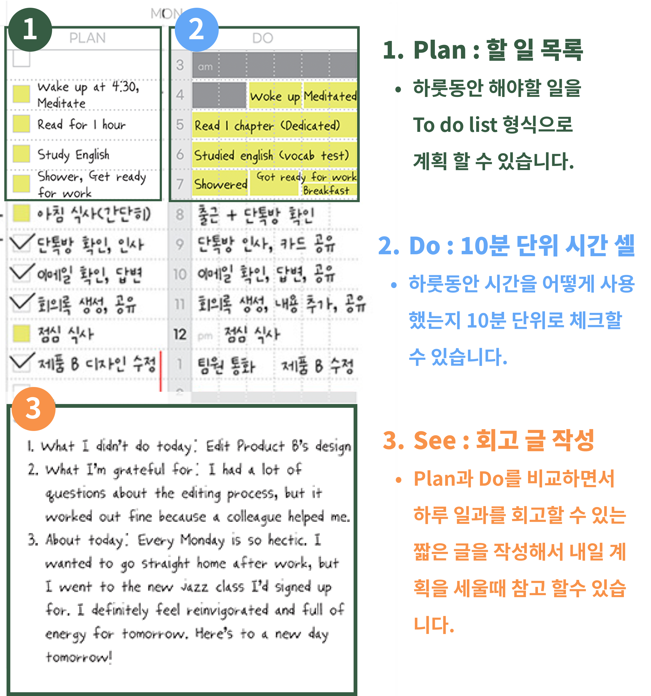

# PDS Diary


PDS 다이어리는 하루 24시간을 10분 단위로 일정을 관리 할 수 있는 다이어리 웹 앱입니다.

<hr>

### 🔗 Depoly URL : https://www.pdsdiary.com

<br />

## 💼 목차
- ### [🚀 기술 스택](#기술-스택)
- ### [💡 기획 동기](#기획-동기)
  - [1. PDS 다이어리란?](#1-pds-다이어리란)
  - [2. PDS 다이어리의 장점](#2-pds-다이어리의-장점)
  - [3. 프로젝트의 목표](#3-프로젝트의-목표)
    - [3.1 웹으로 다이어리를 개발할 때 편리한 UI/UX 구현을 위한 고민](#31-웹으로-다이어리를-개발할-때-편리한-uiux-구현을-위한-고민)
    - [3.2 텍스트 편집기 & 드래그 기능을 직접 구현을 통한 원리 이해](#32-텍스트-편집기--드래그-기능을-직접-구현을-통한-원리-이해)

- ### [⚒️ 기능 소개](#기능-소개)
- ### [🔥 기술 챌린지](#기술-챌린지)
  - [1. ⏱️ 10분 단위의 시간 셀을 어떻게 렌더링 할 수 있을까?](#1-10분-단위의-시간-셀을-어떻게-렌더링-할-수-있을까?)
    - [1.1 초기 접근 방식 : 렌더링 구조를 고려해서 1시간을 24번 반복 렌더링 하기](#11-초기-접근-방식--렌더링-구조를-고려해서-1시간을-24번-렌더링-하기)
    - [1.2 문제 인식 : 다음 행으로 넘어가는 시간셀에 연속적인 드래그 기능 구현의 어려움](#12-문제-인식--다음-행으로-넘어가는-시간셀에-연속적인-드래그-기능-구현의-어려움)
    - [1.3 해결 방안 모색 : 144개의 시간정보를 가진 데이터 반복 렌더링](#13-해결-방안-모색--144개의-시간정보를-가진-map-데이터-반복-렌더링)
    - [1.4 구현 결과 : Map을 활용한 빠른 데이터 조회와 생성 순서 보장](#14-구현-결과--빠른-데이터-조회와-시간의-순서-보장)
  - [2. ⇱ 셀의 드래그 기능은 어떻게 구현할수 있을까?](#2-셀의-드래그-기능은-어떻게-구현할-수-있을까?)
    - [2.1 아이디어 : 여러가지 이벤트를 조합해서 적절한 UI 변경해주기](#21-아이디어--여러가지-이벤트를-조합해서-적절한-ui-변경해주기)
    - [2.2 문제 인식: 드래그의 방향을 어떻게 판별 할 수 있을까?](#22-문제-인식-드래그의-방향을-어떻게-판별-할-수-있을까)
    - [2-3 문제 해결 : `useRef`를 활용해서 인덱스를 저장해서 계산하자](#2-3-문제-해결--useref를-활용해서-인덱스를-저장해서-계산하자)
  - [3. 시간 셀의 일정 관리는 어떻게 해야할까?](#3-시간-셀의-일정-관리는-어떻게-해야할까?)
    - [3.1 이벤트 관리 : 전역상태로 관리하고 변경사항 발생시 전역상태와 DB에 업데이트](#31-이벤트-관리--전역상태로-관리하고-변경사항-발생시-전역상태와-db에-업데이트)
    - [3.2 UI/UX : Google Sheet에 착안한 이벤트 유무에 따른 작업 선택 토글창 렌더링](#32-uiux--google-sheet에-착안한-이벤트-유무에-따른-작업-선택-토글창-렌더링)
    - [3.3 예외 케이스 처리 : 중복된 이벤트 추가 방지를 위한 드래그 기능 제한](#33-예외-케이스-처리--중복된-이벤트-추가-방지를-위한-드래그-기능-제한)
  - [4. 📝 textEditor 어떻게 구현 할 수 있을까?](#4-textEditor-어떻게-구현-할-수-있을까?)
    - [4.1 아이디어 : `execCommand()`를 사용해서 스크롤 된 텍스트에 스타일 적용](#41-구현-방법-찾기--execcommand를-사용해서-스크롤-된-텍스트에-스타일-적용하기)
    - [4.2 문제 인식 : 직접적인 DOM조작은 리액트에서 권장하는 방식이 아니다?!](#42-문제-인식--상태-변화를-통하지-않고-직접적인-dom조작은-리액트에서-권장하는-방식이-아니다)
    - [4.3 문제 해결 : `window.getSelection()`을 사용한 스타일 변경후 상태관리](#43-문제-해결--windowgetselection을-사용해서-스타일-변경후-상태로-관리하기)
    - [4.4 해결 결과 : 유지보수 비용 절약을 위해 적절한 라이브러리 사용 필요](#44-해결-결과--장기적으로-기능-추가시-유지보수-비용-절약을-위해-적절한-라이브러리-사용-필요)

- ### [✍️ 회고](#✍️-회고)

<br />

<h2 id="기술-스택">🚀 기술 스택</h2>

### FrontEnd
<div style="display:flex;">
  &nbsp;
  &nbsp;
  &nbsp;
  &nbsp;
</div>

### BackEnd

<div style="display:flex;">
  &nbsp;
  &nbsp;
  &nbsp;
  
</div>

<br />

<h2 id="기획-동기">💡 기획 동기</h2>

나는 하루 24시간을 어떻게 보내고 있을까? 계산해 보면 생각보다 몰입도 있게 업무에 집중했던 시간은 짧고 계획 없이 무의식적으로 TV나 휴대폰 스크린을 보며 낭비하고 있던 시간이 길다는 사실에 놀랐던 경험이 한 번쯤 있을 것으로 생각합니다.

저 또한 이런 경험이 많았고 하룻동안 낭비하는 시간을 줄이고 좀더 의미있게 사용하고자 시간 관리 방법으로 다이어리를 활용하였고 저에게 큰 도움이 되던 이 다이어리를 더 많은 사용자가 사용할 수 있도록 웹으로 만들면 좋겠다는 생각으로 다이어리를 주제로 선정하게 되었습니다.

### 1. PDS 다이어리란?


제가 처음부터 프로젝트의 레퍼런스로 삼고자 했던 `PDS 다이어리`는 하루 일과를 계획하고 실행하고 피드백한다는 의미의 Plan, Do, See 의 약어를 캐치프레이즈로 내세워서 자기 계발을 위해서 시간을 집약적으로 사용해서 삶의 변화를 원하는 사람들을 위해 기획된 다이어리입니다.

### 2. PDS 다이어리의 장점

다이어리 앱을 개발할 때 PDS 다이어리의 레이아웃 형태를 차용하고자 했던 이유로는 다음과 같습니다.



1. **10분 단위의 시간 관리**

    To Do List 형태로 일정을 관리하거나 30분이나 1시간 단위로 일정을 관리하는 서비스는 많았으나, 24시간을 10분 단위로 나누어서 시간별로 일정을 관리할 수 있는 서비스는 없어서 다른 서비스들보다 시간을 집약적으로 계획할 수 있다는 장점이 있었습니다.

2. **회고 작성을 통한 빠른 피드백 반영**

    페이지마다 간단한 하루 일과를 회고하며 글을 작성할 수 있는 무선 칸 영역이 있어서 반성할 점이나 새로운 다짐들을 짧게 작성해서 한눈에 보기도 쉽기 때문에 다음 일정을 계획할 때 피드백을 통해 점차 개선된 일정을 계획할 수 있다는 장점이 있었습니다.

3. **직관적인 레이아웃 디자인**

    다이어리에 핵심이 되는 3가지 영역만으로 자신이 그날 무슨일을 계획했고 어떻게 시간을 보냈는지 직관적으로 파악 할 수 있다는 장점이 있었습니다.

### 3. 프로젝트의 목표

이번 프로젝트를 통해서 달성하고자 했던 목표로는 아래와 같습니다.

  #### 3.1 웹으로 다이어리를 개발할 때 편리한 UI/UX 구현을 위한 고민

- 사용자가 다이어리를 수기로 작성하지 않고 웹에서 작성하고자 할 때 기대하는 UI/UX를 충족하기 위해서 어떤 점을 고려해야 할지 고민하면서 앞으로 사용자 경험을 중심으로 개발하는 개발자가 되기 위해 좋은 경험이 될 것이라고 생각했습니다.<br />

- 웹에서 편리한 UI/UX을 제공하고자 고민했던 부분은 다음과 같습니다.<br />

  **편리한 시간 선택과 일정 추가 시 스타일 적용** 
  
  |다이어리에서 일정 추가 시|웹에서 일정 추가 시|
  |----|----|
  |||
  
  - 다이어리에서 일정을 추가할 때는 보통 색깔로 일정을 구분 짓게 되는데 웹에서도 배경색으로 일정을 구분 짓기 위해서 일정울 추가할 때 배경색을 지정할 수 있게 하고자 했습니다.
  
  - 일반적으로 일정을 추가할 때 시간을 지정해 줘야 하지만, 10분 단위의 시간 셀을 드래그한 만큼 자동으로 시간이 특정 지어져서 간편하게 일정을 추가할 수 있도록 하고자 했습니다. <br />

  **반복된 일정의 복사 기능** 
  
  - 사용자가 똑같은 일정을 반복해서 추가 하려고 할 때 시간과 일정 내용을 다시 입력하지 않아도 이미 추가된 일정을 재사용해서 복사 할 수 있는 기능을 구현하고자 했습니다.

  **텍스트 편집 기능 제공** 
  
  - 사용자가 하루의 일정을 회고할 수 있는 텍스트 영역에서 간단한 스타일도 함께 적용 할 수 있는 텍스트 편집기 기능을 구현하고자 했습니다. <br />

  #### 3.2 텍스트 편집기 & 드래그 기능을 직접 구현을 통한 원리 이해

  어쩌면 일상속에서 가장 자주 사용하고 있었던 드래그 기능이나 텍스트 편집 기능이 어떤 원리로 동작 되는지 생각해보지 않았었는데 이번 기회에 어떤 원리로 기능이 동작하는지 이해하고자 라이브러리를 사용하지 않고 Javascript 로 직접 구현고자 했습니다.<br />

<h2 id="기능-소개">⚒️ 기능 소개</h2>

### 1) 스케줄 복사 기능
<details>
  <summary>🎥 시연 영상</summary>
  <p>
    
  </p>
</details>

→ 사용자가 추가한 스타일과 일정을 특정 시간에 붙여넣기 할 수 있습니다.<br />
> 클립보드에 복사된 이벤트가 있으면 붙여넣기 할수있는 버튼이 렌더됩니다.<br />
> 추가하려는 시간에 기존 이벤트가 존재하면 에러 토스트가 렌더링됩니다.
<br />

**개선할 점**
- 현재는 복사된 이벤트를 한번만 붙여넣기 해도 전역상태로 저장된 클립보드 데이터가 사라지는데, 한번 복사된 이벤트를 여러번 붙여넣을 수 있도록 로직을 개선할 수 있습니다.

### 2) 일정 연동 기능

<details>
  <summary>🎥 시연 영상</summary>
  <p>
    
  </p>
</details>

→ 사용자가 Plan 섹션에서 일정 추가시 연동 버튼을 누르면 Do 섹션의 동일한 시간에 이벤트가 추가되고 일정이 변경되는 경우 동기화되어서 적용됩니다.<br />
> 빨간색 테두리는 이전 버전과 대비하여 이후 버전에서 변경사항이 생긴 요소 입니다. <br />
> 초록색 테두리는 이전 버전에는 존재하지 않았으나, 이후 버전에서 새롭게 추가된 요소입니다.

**개선할 점**

- 현재는 시간별 수행한 일 Do 섹션과 헤애햘 일 Plan 섹션에 이벤트가 연동 되어있을 때 Plan 섹션에서는 이벤트를 수정하면 Do 섹션에도 바로 반영이 되는 반면에 Do 섹션에서는 이벤트를 수정 할 수가 없다.


<br />

### 3) 일정 삭제 기능

<details>
  <summary>🎥 시연 영상</summary>
  <p>
    
  </p>
</details>

→ Do 섹션에서 일정 삭제시 해당 일정에 해당하는 모든 시간 셀이 선택되고 일정을 삭제하거나 수정할수 있습니다. <br />
> 일정 선택시 작업을 선택할수 있는 모달창이 렌더 됩니다. <br />
> 기존에 복사된 일정이 있더라도 복사된 일정을 덮어쓰기 할 수 있습니다. <br />

### 4) 텍스트 편집 기능

<details>
  <summary>🎥 시연 영상</summary>
  <p>
    
  </p>
</details>

→ See 섹션에서 사용자가 하루 일정에 대한 리뷰를 작성 할 수 있습니다.<br />
> 사용자가 선택한 글자의 영역에 스타일이 적용됩니다.<br />
> 기존에 복사된 일정이 있더라도 복사된 일정을 덮어쓰기 할 수 있습니다. <br />

<br />

<h2 id="기술-챌린지">🔥 기술 챌린지</h2>

<h3 id="1-10분-단위의-시간-셀을-어떻게-렌더링-할-수-있을까?">1. ⏱️ 10분 단위의 시간 셀을 어떻게 렌더링 할 수 있을까?</h3>

#### 1.1 초기 접근 방식 : 렌더링 구조를 고려해서 1시간을 24번 렌더링 하기

> 1시간을 10분 간격으로 6칸으로 나눈 `Array` 를 24번 반복 렌더링 하기

처음에는 24시간을 6 * 24 의 표 형태로 렌더링 하기 위해서 10분단위로 6칸으로 나누어진 1시간 셀을 세로로 24번 반복 렌더링 하고자 했습니다.

그래서 저는 24개의 요소를 가진 배열형태를 고려했었고 각 요소를 Object 형태로 key값으로는 시간 문자열을 가지고 value값으로는 10분 간격의 시간데이터를 배열로 가지게 데이터를 구상했었습니다.


```js
const time = [
  { "01:00": [0, 10, 20, 30, 40, 50] },
  { "02:00": [0, 10, 20, 30, 40, 50] },
  // ... 22개의 나머지 시간들
];
```

<br />

#### 1.2 문제 인식 : 다음 행으로 넘어가는 시간셀에 연속적인 드래그 기능 구현의 어려움

  - 시간마다 데이터를 반복 렌더링 할때마다 공통으로 사용되는 이벤트 핸들러를 Prop으로 추가 해주어야 하기 때문에 코드의 가독성이 낮아진다고 판단했습니다.
  - 시간 셀을 드래그 하여서 시간을 연속적으로 선택 할 수 있어야했는데 다음 행으로 넘어가는 시간의 시간을 특정 짓기 위해서 time 배열 데이터를 다시 순회해서 시간의 연속성을 추가 로직이 필요했습니다.

<br />

#### 1.3 해결 방안 모색 : 144개의 시간정보를 가진 Map 데이터 반복 렌더링

> 24시간을 10분으로 나눈 144개의 요소를 가진 `Object` 를 반복 렌더링 하기

기존의 24개의 요소를 가진 Array를 순회하며 반복 렌더링 하는 방법에서 144개의 요소를 가진 Object를 반복 렌더링 하는 방법으로 변경하였습니다.

각 요소의 key 값으로는 시간 셀이 있고 value 값으로는 시간정보와, 이벤트 정보를 가지고 있는 object 를 넣어줌으로서 연속적인 시간을 렌더링 하므로 드래그 기능을 구현하기 편리할것이라고 생각했습니다.


```js
const time = {
  "00:00" : { time: "00:00", event: null },
  "00:10" : { time: "00:10", event: null },
  // ... 142개의 나머지 시간들
}
```


- 하나의 행에는 6칸이 넘어가는 경우 다음 행으로 줄바꿈 되어서 시간 셀이 렌더링 되게 하기 위해서 하나의 행에 width 값을 지정해서 `flex-wrap: wrap` CSS 속성을 추가해서 한 행의 가로 길이를 넘어가면 다음줄로 줄바꿈 되서 렌더링 되도록 하였습니다.


🚫 문제 발생

```js
const time = {
  "00:00" : { time: "00:00", event: null },
  "00:10" : { time: "00:10", event: "3km 달리기" },
  // ... 142개의 나머지 시간들
}

function getEventByTime(targetTime) {
  const entries = Object.entries(time);

  // Objcet 객체를 한번더 순회하며 O(n)의 시간복잡도를 가짐.
  const [time, event] = entries.find([key, value] => key === targetTime);
  
  return event;
}

console.log(getEventByTime("00:00")); // null
console.log(getEventByTime("00:10")); // "3km 달리기"

```

  - Object는 인덱스가 없으므로 특정 시간을 가진 키값의 데이터에 접근하기 위해서 한번 더 객체를 순회하기 떄문에 빠르게 데이터를 조회할 수 있는 Object의 특징을 활용할 수 없었습니다.
  
  - 특정 시간의 이벤트에 변동사항이 생기는 경우 해당 객체의 키값을 재할당 후 렌더링 할때 Object는 시간의 연속성을 보장할수 없는 문제가 발생했습니다.


✅ 문제 해결
  - Object의 장점을 활용하면서도 객체의 생성순서를 보장하는 Map 자료구조를 활용했습니다.

<br />

#### 1.4 구현 결과 : 빠른 데이터 조회와 시간의 순서 보장 

> Object는 생성된 순서를 보장하는 Map 데이터 반복 렌더링 하기

  - 시간 데이터를 Map 구조로 변경해 인덱스마다 시간셀의 정보를 가지게 하여서 목록 렌더링시 시간의 연속성을 보장 할 수도 있고 Object의 특성을 사용 해서 특정 인덱스의 시간에 빠르게 접근할 수 있었습니다.

<br />

<h3 id="2-셀의-드래그-기능은-어떻게-구현할-수-있을까?">2. ⇱ 셀의 드래그 기능은 어떻게 구현할수 있을까?</h3>

사용자가 드래그한 시간 셀의 영역 만큼 시간을 특정지어서 일정을 추가할수 있게 하기 위해서 드래그 기능을 구현 하면서 아래와 같은 사고 과정을 거쳤습니다.

#### 2.1 아이디어 : 여러가지 이벤트를 조합해서 적절한 UI 변경해주기

1. **드래그동작 구현을 위해서 여러가지 이벤트를 조합하기**

    > 드래그란 사용자가 마우스를 클릭한 상태로 움직였다가 떼는 동작으로 여러개의 이벤트로 구성되어 있습니다.
    > 
    > 즉, 드래그 동작시 발생하는 각각의 이벤트에 따라 적절하게 UI가 바뀌어야 함을 의미합니다.

  #### 어떤 이벤트를 조합하는게 좋을까?
- 드래그 기능에 사용되는 이벤트 조합으로는 크게 3가지가 있음을 확인했습니다.

| 이벤트 조합 | 장점 | 단점 |
|-------------|------|------|
| `onMouseDown`<br>`onMouseMove`<br>`onMouseUp` | - 모든 브라우저에서 호환성 좋음<br>- 마우스 커서 위치 추적 가능<br>- 다양한 마우스 인터랙션 구현 가능 | - 터치 기기에서 작동하지 않음<br>- 마우스 커서가 화면 밖으로 나가면 이벤트 작동 안함<br>- 드래그 앤 드롭 기능을 위해 추가 코드 필요 |
| `onDragStart`<br>`onDrag`<br>`onDragEnd` | - 드래그 앤 드롭 기능 쉽게 구현 가능<br>- 터치 기기에서도 작동<br>- 마우스 커서가 화면 밖으로 나가도 작동 | - 일부 브라우저에서 기본 동작 방지를 위해 추가 코드 필요<br>- 드래그 앤 드롭 이외의 인터랙션 구현 어려움<br>- 드래그 앤 드롭 기능에 특화 |
| `onPointerDown`<br>`onPointerMove`<br>`onPointerUp` | - 마우스와 터치 입력 모두 지원<br>- 마우스 커서가 화면 밖으로 나가도 작동<br>- 새로운 입력 장치에도 호환 가능 | - 현재 브라우저 호환성 낮음, 폴리필 필요<br>- 이벤트 객체 속성이 브라우저마다 다를 수 있음<br>- 드래그 앤 드롭 기능을 위해 추가 코드 필요 |


저는 모바일 환경에서의 대응을 하지 않기 때문에 모든 브라우저에서 호환성이 높은 `onMouseDown`, `onMouseMove`, `onMouseUp` 조합을 사용하여 이벤트 기능을 구현하고자 했습니다.

드래그 중일때 이벤트 핸들러를 작성하기 위해서 `onMouseEnter`와 `onMouseMove`의 사용을 고려했었는데
| 이벤트 | 특징 |
|--------|------|
| `onMouseEnter` | - 드래그 대상 요소에 마우스가 진입했을 때 한 번만 발생. <br />- 불필요한 이벤트 핸들링을 피할 수 있어 성능 저하를 최소화할 수 있음. <br />- 드래그 중인 요소의 실시간 위치를 추적할 수 없음.<br>- 다른 이벤트와 함께 사용해야 하므로, 코드가 복잡해질 수 있음. |
| `onMouseMove` | - 마우스 커서의 실시간 위치를 추적할 수 있어, 위치를 업데이트에 적합함.<br>- 다른 이벤트 함께 사용하여 드래그 기능을 완벽하게 구현할 수 있음. <br>- 이벤트가 여러번 발생해서 성능 저하가 발생할 수 있음. |

저는 불필요한 이벤트 핸들링을 피하기 위해서 onMouseEnter를 사용했습니다.

2. 각각의 이벤트 핸들러가 상호작용을 하며 UI가 적절히 바뀌어야한다.

  ### 드래그 동작 과정에 따라서 어떤 로직을 수행해야 할까?

- 드래그의 동작과정을 크게 3가지로 분류해서 이벤트 핸들러를 작성했습니다.

|사용자 동작|사용된 이벤트|동작|
|------|---|---|
|드래그 시작|onMouseDown|- `useRef`에 시작 인덱스 저장|
|드래그 중|onMouseMove|- 시작인덱스에 따른 드래그 방향 로직 수행<br />- 드래그된 영역 배경색 변경|
|드래그 종료|onMouseUp|- 시작인덱스와 종료시점 인덱스 차이 계산<br />- 드래그된 영역 배경색 변경|

  - 브라우저에서 제공하는 마우스 이벤트마다 다른 로직을 수행하도록 드래그 핸들링을 작성해서 드래그중에 UI가 변경됨에 따라서 사용자가 드래그 된 영역을 알수 있게 했습니다.

#### 2.2 문제 인식: 드래그의 방향을 어떻게 판별 할 수 있을까?

 

 사용자는 드래그를 뒤에서 앞으로 역방향으로 할 수도 있고 앞에서 뒤로 정방향으로 할수도 있는데 역방향으로 드래그 했을때 드래그를 시작하는 인덱스를 다르게 적용해서 드래그 된 영역을 계산하는 로직을 작성해야 했습니다.
 
#### 2-3 문제 해결 : `useRef`를 활용해서 인덱스를 저장해서 계산하자

  - 드래그를 시작했을때 선택된 인덱스 정보를 `useRef` 를 사용해서 저장하게 하였고 드래그를 마쳤을때 인덱스 차를 구해서 사용자가 드래그 한 시간을 특정 지을 수 있었습니다.

    ```javascript
    // 정방향 드래그
    const isForwardSelection = timeCell.index > startIndex && timeCell.index > endIndex;

    ...

    // 역방향 드래그
    const isBackwardSelection = timeCell.index < startIndex && timeCell.index < endIndex;

    ...
    ```

  - 드래그를 처음 시작한 인덱스를 기준으로 드래그를 마쳤을때 인덱스의 크기를 비교해서 역방향인지 정방향인지 판단하였습니다.

    - 드래그 시작 인덱스 < 드래그를 마쳤을때 인덱스 => ⬅️ 역방향 드래그 <br />
    - 드래그 시작 인덱스 > 드래그를 마쳤을때 인덱스 => ➡️ 정방향 드래그 <br />

<br />

<h3 id="3-시간-셀의-일정-관리는-어떻게-해야할까?">3. 시간 셀의 일정 관리는 어떻게 해야할까?</h3>

#### 3.1 이벤트 관리 : 전역상태로 관리하고 변경사항 발생시 전역상태와 DB에 업데이트

사용자가 시간 셀을 드래그 했을때 어떤 작업을 수행해야 하는지는 해당 시간 셀의 이벤트의 유무에 따라서 다르게 로직을 적용했어야 했는데, 이는 해당 셀마다 이벤트 정보를 가지고 있어야 함을 의미했습니다.

> 전역상태에서 관리하자

그렇다면 이벤트 정보를 어디서 관리해야할까? 144개의 인덱스를 Map 데이터를 전역상태로부터 시간 셀을 반복 렌더링 하게 되는데 이때 각각의 인덱스마다 이벤트 정보와 시간 셀의 정보를 가지고 있어서 이벤트가 존재 여부에 따라서 다른 작업을 선택할수 있도록 하였습니다.<br />

> 전역상태와 DB에 일정을 업데이트 하자

이벤트에 변경사항이 생겼을때는 어떻게 반영할 수 있을까? 이벤트를 추가하거나 변경 사항이 생겼을때는 전역상태의 시간에도 업데이트 하면서 DB에 일정을 추가해서 다음 로그인시에 DB에 추가된 일정까지 함께 전역상태에 저장해서 일정이 보여지도록 했습니다. <br />

#### 3.2 UI/UX : Google Sheet에 착안한 이벤트 유무에 따른 작업 선택 토글창 렌더링

사용자에게 이벤트의 유무에 따라서 다른 작업을 어떻게 선택하게 할수 있을까? 고민하면서 Google Sheet에서 셀을 드래그해서 마우스 오른쪽 클릭하면 여러가지 작업중 하나를 선택할수도 있고 작업을 선택하지 않는 경우에는 아무런 동작도 하지 않는 점을 착안하여서 시간 셀을 드래그 하면 토글창이 렌더링 되게 하였습니다.

|Google Sheet 셀 드래그 시|PDS Diay 앱에서 셀 드래그 시|
|----|---|
|||


이벤트가 존재하는 경우에는 이벤트를 복사하거나 수정하거나 삭제 할수 있어야하고 이벤트가 존재하지 않는 경우에는 이벤트를 추가하거나 복사한 이벤트를 붙여넣기 할수 있어야 했기 떄문에 이벤트의 유무에 따라서 다른 토글창을 렌더링하게 해서 사용자에게 작업을 선택 할 수 있게 하였습니다.

|이벤트가 존재하는 경우|이벤트가 존재하지 않는 경우|
| ---- | ---- |
|||


#### 3.3 예외 케이스 처리 : 중복된 이벤트 추가 방지를 위한 드래그 기능 제한

사용자가 이벤트가 존재하는 셀과 존재하지 않은 셀을 같이 선택했을 때 이벤트가 존재하는 셀에 다른 이벤트가 중복되어서 추가되는 것을 방지하기 위해서 이벤트가 존재하지 않는 셀의 인덱스만 선택되도록 드래그 영역을 제한해야 했습니다.

- **중복된 이벤트 추가 방지를 위해 드래그 영역 제한**<br />
사용자가 드래그 한 영역에 이벤트가 존재하는 셀이 포함되어 있다면 이벤트가 존재하는 셀의 인덱스를 제외한 나머지의 인덱스에 스타일을 적용해서 이벤트가 존재하지 않는 셀에서 대해서 작업을 진행할 수 있도록 적용했습니다.

  

- **이벤트가 존재하는 셀에서 드래그 기능 제한** <br />
이벤트가 포함된 셀에서는 해당 이벤트에 대한 작업을 수행할 수 있도록 드래그 기능을 제한하고 해당 이벤트가 포함되는 인덱스 범위에 스타일을 적용해서 이벤트 셀이 전체 선택된것처럼 보이도록 UI를 구현했어야 했습니다. 

  

  이벤트가 존재하는 시간 셀을 선택했을 때 해당 이벤트에 대해서 추가 작업을 진행할 수 있는 토글창을 렌더링 하도록 적용했습니다.

<br />

<h3 id="4-textEditor-어떻게-구현-할-수-있을까?">4. 📝 textEditor 어떻게 구현 할 수 있을까?</h3>

저는 사용자가 하루의 일과를 회고할수 있는 간단한 텍스트 편집기를 구현하고자 했습니다. 텍스트 편집기를 구현하기 위해서는 `Quill.js` 와 `Slate.js`, `Draft.js`  등 다양한 라이브러리가 있음을 확인했습니다 하지만 저는 텍스트 에디터가 동작하는 원리를 학습하고자 직접 Javascript로 구현하면서 다음과 같은 사고 과정을 거쳤습니다.

#### 4.1 구현 방법 찾기 : `execCommand()`를 사용해서 스크롤 된 텍스트에 스타일 적용하기

- 텍스트 편집 기능을 구현하기 위해서는 사용자가 스크롤한 텍스트 영역에 스타일을 적용해야 했습니다.
- 브라우저 API에서는 텍스트에 스타일을 적용할 수 있는 편집 기능을 지원하는 `execCommand()` 메서드를 제공하고 있었습니다.

#### 4.2 문제 인식 : 상태 변화를 통하지 않고 직접적인 DOM조작은 리액트에서 권장하는 방식이 아니다.

예상보다 execCommand()를 사용해서 텍스트 편집 기능을 구현하는데는 기술적으로 큰 어려움은 없었으나 다음과 같은 이유로 대안을 찾아야 했습니다.

1. React에서는 직접적으로 dom을 조작하기 보다 상태 변경을 통해 Virtual DOM을 업데이트하고, 리렌더링 함으로서 실제 DOM을 업데이트해서 UI를 렌더링하는 것을 권장합니다.
2. `execCommand()` 는 deprecated 된 메서드로 향후 호환성 이슈를 방지하게 위해 다른 대안을 찾아야 했습니다.

#### 4.3 문제 해결 : `window.getSelection()`을 사용해서 스타일 변경후 상태로 관리하기 

- `execCommand()` 를 사용해서 직접 DOM에 스타일을 적용하는 방법에서 상태관리를 통해 스타일이 적용하는 방법으로 변경하고자 했습니다.

- 대안으로 사용할 수 있는 방법으로는 브라우저 API에서 제공하는 `window.getSelection()` 과 `range`를 사용해서 스크롤된 텍스트의 위치를 특정지어서 스타일 태그를 적용할수 있었습니다.


`window.getSelection()` 과 `range`를 사용한 간단한 예시 코드입니다.

```js
function onTextSelect() {
  // 현재 선택된 텍스트 정보를 가져옵니다.
  const selection = window.getSelection();
  
  if (selection.rangeCount > 0) {
    // 선택된 텍스트의 범위를 가져옵니다.
    const range = selection.getRangeAt(0);
    
    // <span> 요소에 스타일을 적용
    const newNode = document.createElement('span');
    newNode.style.fontWeight = 'bold';
    
    // 선택된 텍스트를 <span> 요소로 감싼다.
    range.surroundContents(newNode);
    
    selection.removeAllRanges();
  }
}
```

#### 4.4 해결 결과 : 장기적으로 기능 추가시 유지보수 비용 절약을 위해 적절한 라이브러리 사용 필요

**➡️ 구현 결과**
> 1. 라이브러리 의존 없이 직접 구현하면서 Javascript 와 브라우저의 동작원리에 대한 이해도를 높일수 있었습니다.
>
> 2. 부분적으로 텍스트를 상태관리를 통해서 1개의 단일 스타일을 적용하고 해제하는 기능을 구현 할수 있었습니다.

**🚫 추가 문제 발생**
- 마지막으로 텍스트를 작성한 위치의 Caret 위치 저장 이슈 발생
- 스타일이 중첩되에서 텍스트에 적응될 경우 스타일 해제 에러 발생
- 개행이 포함된 문자열에 스타일 적용시 개행 해제되는 이슈 발생
- 스티커 기능, 이미지 삽입기 능 등 기능을 추가할때 유지보수가 어려움

**향후 개선책**

> 아래와 같은 이유로 텍스트 편집기능이 서비스의 주요 기능이 아니라고 한다면 라이브러리를 사용하거나 `execCommand()` 메서드를 제한적으로 사용해서 리팩터링 하는것이 장기적으로 기능 추가를 염두해두고 있는 저의 상황에서 더 적합하다고 판단했습니다.

1. 예상했던것보다 상태관리를 통해 텍스트 편집기능을 직접 구현하기 위해서는 고려해야 하는 엣지 케이스가 많다.
2. 엣지 케이스를 대응을 위한 로직이 추가됨에 따라서 코드 가독성이 저하되고 유지보수가 어려워 진다.

<h2 id="개발-일정">🗓️ 개발 일정</h2>

프로젝트 기간: 2024.03.04(월) ~ 2024.03.27(수) (3주) <br />
<br />


1주차
- [칸반 보드 작성](https://sand-tapir-46f.notion.site/Solo-Project-0967a6d7b7344b0bbfc47ac22b39bfb5?pvs=4)
- [프로젝트 아이디어 선정](https://sand-tapir-46f.notion.site/8f6f3f192c584ef38824ffdef4c0f4c0?pvs=4)
- [POC 기술 검증](https://sand-tapir-46f.notion.site/POC-7abb3e99592e4a1a82aae5a94edc6a47?pvs=4)
- [피그마 목업 작성하기](https://www.figma.com/design/ZrmPxIyvJ86oDDIrFTOfJz/P.D.S-Diary-Flow-Chart?node-id=0-1&t=fxTjs4QNjWqcgYsk-1)
- [API 명세서 작성](https://sand-tapir-46f.notion.site/API-4dc6e5c4d71d4107a4a64998141c417f?pvs=4)
- [MongoDB 스키마 구조 설계](https://lucid.app/lucidchart/206868d1-f324-4421-81e7-21dabd689e72/edit?viewport_loc=-1399%2C-410%2C1257%2C1784%2C0_0&invitationId=inv_642d7865-4d91-4b52-8975-c0327b1ed357)

2주차
- Zustand 글로벌 상태 정규화
- 로그인 기능 구현
- 라우터 작성, 서비스 메인 컴포넌트 개발
- 시간 셀 드래그 기능 구현
- 일정 CRUD 기능 구현

3주차
- 클라이언트 AWS S3 + CloudFront 배포
- 서버 AWS CodePipeline + EB 배포
- Git Action을 사용한 CI/CD 배포 자동화 설정 

~ 현재까지
- 컴포넌트 단위별 테스트 코드 작성
- Typescript 마이그레이션 예정
- 모바일 대응 및 구글 Analytics 적용

<h2 id="프로젝트-회고">✍️ 회고</h2>

<details><summary>고경준</summary>
개인 프로젝트는 기획부터 배포 운영까지 모두 혼자서 책임져야 했었기 때문에 기획했던 일정에 차질이 생기지 않도록 시간관리에 중요성에 대해서 배우게 되었습니다.

<br />

평소에 당연하게 생각했던 텍스트 편집기나 드래그 기능에도 편리한 UI/UX를 위해서 수많은 경우들을 고려해서 개발된 기능이라는것을 알 수 있었고, 작은 기능 하나를 구현하더라도 사소한 경우까지 모두 고려해서 사용자가 불편함을 인식하지 못할정도로 자세하게 UI/UX를 기획해야 한다는 점을 배우게 되었습니다.

<br />

평소 개발을 할때 왜? 라는 질문보다 어떻게? 해야할까를 먼저 생각했었는데 이번 프로젝트를 계기로 어떤 기술을 사용하고 어떻게 구현해야 겠다는 생각 앞에는 `왜?`라는 질문이 먼저 들어가 체계적인 사고 과정이 반드시 필요하다는것을 배울 수 있었습니다.

<br />

</details>